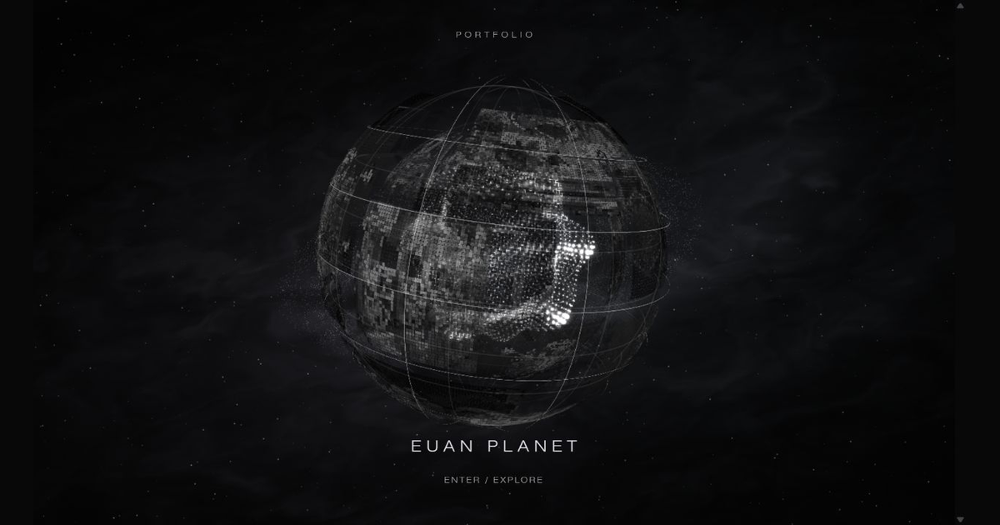

# 熊志愿｜视觉与交互设计作品集

**EUAN PLANET · Visual & Interaction Design Portfolio**

从视觉叙事、三维空间到实时视听交互，展示我的设计研究、制作过程与项目成果。网站提供完整中英文内容。

**[打开在线作品集](https://xiongzhiyuan-portfolio.pages.dev/) · [查看全部作品](https://xiongzhiyuan-portfolio.pages.dev/zh/works/) · [English portfolio](https://xiongzhiyuan-portfolio.pages.dev/en/) · [关于我与简历](https://xiongzhiyuan-portfolio.pages.dev/zh/about/)**

[](https://xiongzhiyuan-portfolio.pages.dev/)

## 项目目录

当前收录 12 个项目条目：11 个完整案例，以及进行中的饭搭子项目。各案例说明个人职责、完成阶段、研究与制作过程；协作项目保留贡献说明。

| 项目 | 方向与内容 | 案例 |
| --- | --- | --- |
| 病名异化实验场 · The Big Bang Stigma | XR、交互体验、虚拟场景与疾病污名研究 | [查看](https://xiongzhiyuan-portfolio.pages.dev/zh/work/stigma/) |
| 相亲嘉年华 · Dating Carnival | 交互叙事、六个三维场景与选择反馈机制 | [查看](https://xiongzhiyuan-portfolio.pages.dev/zh/work/dating-carnival/) |
| 《毒蘑菇》· Poisonous Mushrooms | MV 概念、分镜、场景与宣传小游戏视觉 | [查看](https://xiongzhiyuan-portfolio.pages.dev/zh/work/poisonous-mushrooms/) |
| ALILAGUNA | 概念音乐影像、实拍、剪辑、调色与 VFX | [查看](https://xiongzhiyuan-portfolio.pages.dev/zh/work/alilaguna/) |
| 机械文明计划 · NEXUS | 叙事向概念游戏场景、三维建模与渲染 | [查看](https://xiongzhiyuan-portfolio.pages.dev/zh/work/nexus/) |
| 骨骸共生系统 · SPRING Skeleton Collection | 品牌视觉、Logo 与骨骸系列三维首饰 | [查看](https://xiongzhiyuan-portfolio.pages.dev/zh/work/bone-series/) |
| NO.3 后数字物种 · Post-digital Species | 数字永生世界观、三阶段三维场景与物种档案 | [查看](https://xiongzhiyuan-portfolio.pages.dev/zh/work/post-digital-species/) |
| 声学弹性 · Sonic Elasticity | 实体装置、四声道声场、Max/MSP 与 Arduino 联动 | [查看](https://xiongzhiyuan-portfolio.pages.dev/zh/work/sonic-elasticity/) |
| 无垠的宇宙 · Infinite Cosmos | 参数化空间、Rhino 模型、Processing 粒子与生成影像 | [查看](https://xiongzhiyuan-portfolio.pages.dev/zh/work/infinite-cosmos/) |
| 地震：数据转译 · Earthquake: Data into Space | Python 多源数据处理、空间生成与实时可视化 | [查看](https://xiongzhiyuan-portfolio.pages.dev/zh/work/earthquake/) |
| 蜕变 · Metamorphosis | TouchDesigner 几何、粒子反馈与实时声音交互 | [查看](https://xiongzhiyuan-portfolio.pages.dev/zh/work/metamorphosis/) |
| 饭搭子 · FanDazi | UX／产品设计，进行中 | [作品索引](https://xiongzhiyuan-portfolio.pages.dev/zh/works/?project=fandazi) |

## 网站体验

- 原生 WebGL 星球入口、项目分区和作品轮播。
- 影像转场、三维／点云展示与声音交互。
- 中英文切换、移动端布局、键盘导航和减少动态效果支持。
- 案例图片查看器、作品影片和双语简历下载。

## 本地运行

需要 Node.js 22.12 或以上，以及 pnpm 11。仓库包含网站运行所需的图片、视频、字体字集、几何与数据文件。

```sh
pnpm install --frozen-lockfile
pnpm dev
```

打开 `http://127.0.0.1:4321/zh/`。

```sh
pnpm check   # 类型检查
pnpm build   # 生成静态网站 dist/
pnpm test    # 检查生成页面、内部链接与项目素材
pnpm preview # 预览构建结果
```

## 文件结构

```text
src/data/        项目清单、中英文文案与项目数据
src/components/  案例、交互与布局组件
src/pages/       双语页面与路由
src/scripts/     WebGL、转场、轮播与实时交互
src/styles/      视觉样式与响应式布局
public/          网站图片、影片、字体、几何、数据与简历
assets/          网站素材处理所需的部分源资产
scripts/         构建、素材处理与验证工具
docs/            项目实现与发布记录
```

项目入口是 [`src/data/projects.ts`](src/data/projects.ts)，各项目完整文案保存在对应的数据文件与案例组件中。网站使用 Astro、TypeScript、CSS 与原生 WebGL，正式网站托管于 Cloudflare Pages。

仓库保留全部网站展示内容；本地登录授权、缓存、依赖安装目录及未公开原始材料由 `.gitignore` 排除。预制展示素材可直接用于构建；重新提取原始设计文件需要作者的本地材料。

## 验证记录

2026-10-08：类型检查 0 错误、0 警告；静态构建生成 42 个页面；通过 5123 个本地链接／素材引用检查，以及入口加载、轮播、动画生命周期、性能预算和探索入场检查。

## 使用与署名

作品、影像与设计素材用于个人作品展示。协作项目的职责与署名详见对应案例；第三方字体和素材遵循其各自授权，Noto 字体授权见 [`public/fonts/OFL.txt`](public/fonts/OFL.txt)。本仓库未授予作品素材的自由转载或商业使用许可。
