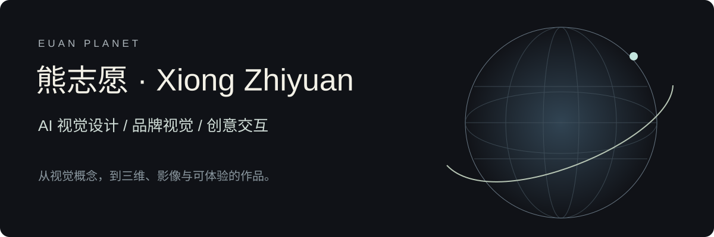
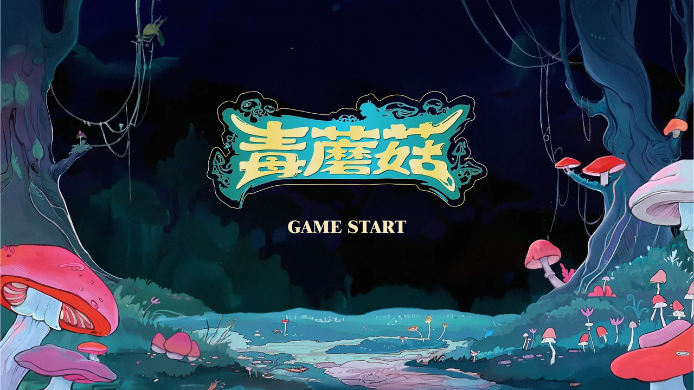
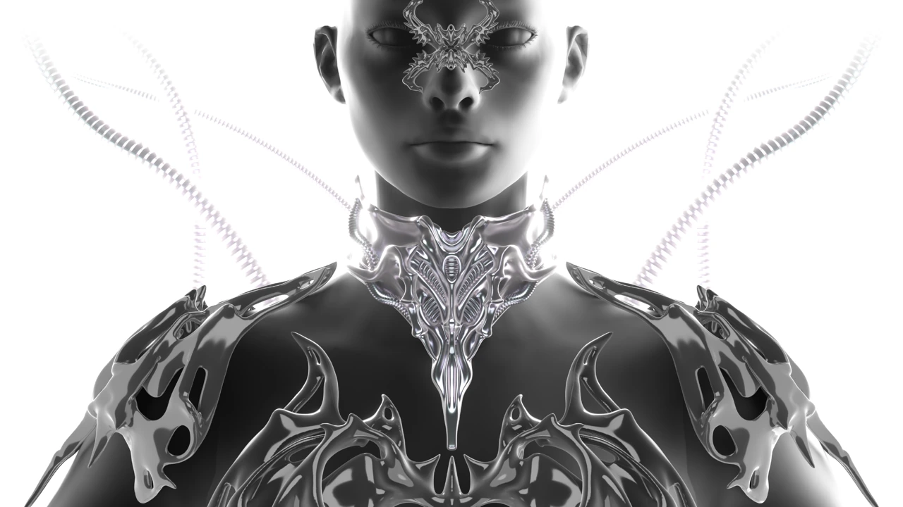
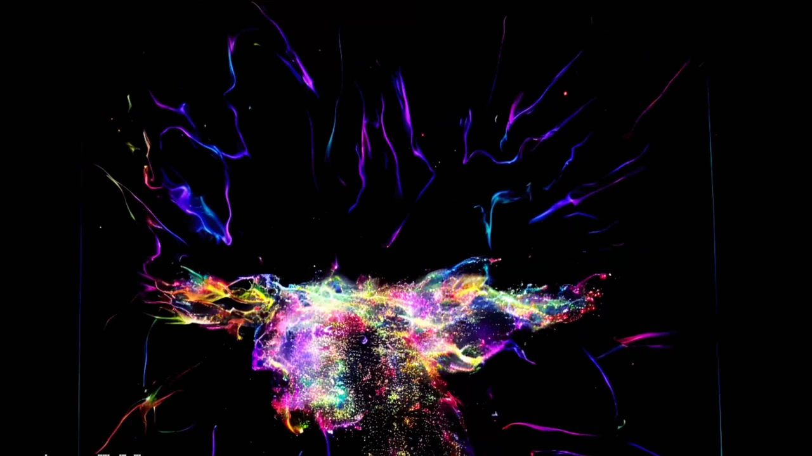
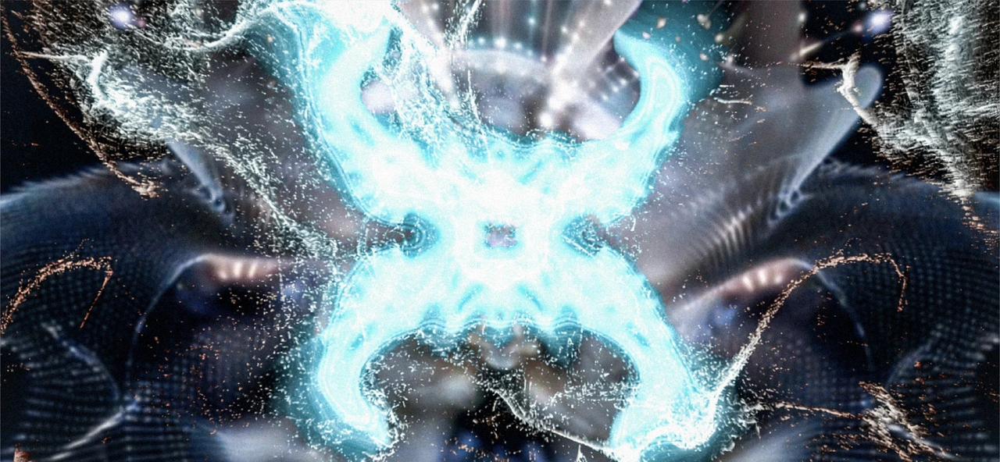

<p align="center"></p>

# 熊志愿｜AI 视觉与创意设计作品集

我把视觉概念转化为品牌、三维、影像与交互作品。关注 AI 辅助的创作流程，也重视人工选择、结构细化和实际体验。

**[GitHub 个人主页](https://github.com/Zhiyuan-Xiong) · [GitHub 项目导航](https://zhiyuan-xiong.github.io/xiongzhiyuan-portfolio/) · [打开完整作品集](https://xiongzhiyuan-portfolio.pages.dev/) · [立即试玩《毒蘑菇》](https://zhiyuan-xiong.github.io/poisonous-mushrooms/) · [关于我与简历](https://xiongzhiyuan-portfolio.pages.dev/zh/about/) · [英文作品集](https://xiongzhiyuan-portfolio.pages.dev/en/)**

本科毕业于华中科技大学设计学院，现于 UCL Bartlett 攻读性能与交互设计硕士。求职方向：AI 设计、视觉设计、创意设计。

## 代表项目与我的贡献

| 项目 | 我的具体贡献 | 项目入口 |
| --- | --- | --- |
| **《毒蘑菇》** | 前期概念、场景与分镜；AI 素材生成与整理、Godot 小游戏搭建和体验验证；参与 MV 调色与视觉统一 | [查看](https://github.com/Zhiyuan-Xiong/poisonous-mushrooms) |
| **骨骸共生系统** | SPRING 品牌视觉与 Logo；Midjourney 图像探索、Tripo 3D 初始建模、ZBrush／Nomad 人工雕刻与首饰细化 | [查看](https://github.com/Zhiyuan-Xiong/spring-skeleton-collection) |
| **无垠的宇宙** | 参数化建模、交互编程与生成影像设计 | [查看](https://github.com/Zhiyuan-Xiong/xiongzhiyuan-portfolio/blob/main/docs/projects/infinite-cosmos.md) |
| **地震：数据转译** | Python 数据处理、参数映射与空间可视化 | [查看](https://github.com/Zhiyuan-Xiong/BARC0074-Digital-Skills-Report-Codebook-25097154) |
| **蜕变** | 模型处理、节点编程、声音映射与视觉合成 | [查看](https://github.com/Zhiyuan-Xiong/xiongzhiyuan-portfolio/blob/main/docs/projects/metamorphosis.md) |
| **饭搭子** | 产品概念、饮食记录与食宠 UX 流程、Godot 交互原型和 AI 照片工作流；进行中 | [查看](https://github.com/Zhiyuan-Xiong/fandazi) |

**[查看精选项目个人贡献](docs/个人贡献.md) · [GitHub 真实贡献与活动](https://github.com/Zhiyuan-Xiong)**

## 作品预览

<table><tr>
<td width="50%"><a href="https://github.com/Zhiyuan-Xiong/poisonous-mushrooms"></a><br><strong>《毒蘑菇》</strong><br>AI 素材工作流、可编辑 Godot 跑酷游戏与浏览器试玩。</td>
<td width="50%"><a href="https://github.com/Zhiyuan-Xiong/spring-skeleton-collection"></a><br><strong>骨骸共生系统</strong><br>SPRING 品牌视觉与骨骸首饰：AI 图像、辅助建模和人工细化。</td>
</tr><tr>
<td width="50%"><a href="https://github.com/Zhiyuan-Xiong/xiongzhiyuan-portfolio/blob/main/docs/projects/infinite-cosmos.md"></a><br><strong>无垠的宇宙</strong><br>Rhino、Grasshopper、Processing 与 ComfyUI 的跨工具创作。</td>
<td width="50%"><a href="https://github.com/Zhiyuan-Xiong/xiongzhiyuan-portfolio/blob/main/docs/projects/metamorphosis.md"></a><br><strong>蜕变</strong><br>TouchDesigner 几何、粒子与实时声音响应。</td>
</tr></table>

## 我的 AI 工作方式

**定义视觉与体验约束 → AI 探索或数据表示 → 人工筛选与调整 → 接入三维／影像／交互 → 验证与整理成果**

- **毒蘑菇**：提示词与素材生成、透明图与动画帧整理、Godot 搭建、玩法和视觉调试，最终可在线游玩。
- **骨骸共生系统**：Midjourney 图像探索 → Tripo 3D 初始建模 → ZBrush／Nomad 人工雕刻、形体与细节调整。
- **无垠的宇宙**：参数化几何、Processing 粒子与 ComfyUI 影像工作流连接。
- **Earthquake**：CLIP 图像表示、文本向量与多源数据融合，转译为空间规则和动态反馈。
- **饭搭子**：把照片识别、人工核对和同风格贴纸生成放进明确的 UX 路径。

各项目仓库分别保留目标、个人贡献、流程与实际材料。效率通过减少重复探索、整理和实现工作来说明；没有用未记录的百分比替代过程证据。

## 求职项目索引

10 个精选项目，8 个独立项目仓库已发布；无垠的宇宙与蜕变的中文说明和完整材料可从本仓库查看，独立仓库待 GitHub 临时限流解除后发布。饭搭子为进行中的 UX 原型。

| 项目 | 类型 | 项目说明／仓库 | 完整案例 |
| --- | --- | --- | --- |
| 病名异化实验场 | XR／交互体验 · 协作项目 | [仓库](https://github.com/Zhiyuan-Xiong/the-big-bang-stigma) | [案例](https://xiongzhiyuan-portfolio.pages.dev/zh/work/stigma/) |
| 相亲营销嘉年华 | 交互叙事／三维空间 | [仓库](https://github.com/Zhiyuan-Xiong/dating-carnival) | [案例](https://xiongzhiyuan-portfolio.pages.dev/zh/work/dating-carnival/) |
| 《毒蘑菇》 | 音乐影像／商业协作 | [仓库](https://github.com/Zhiyuan-Xiong/poisonous-mushrooms) | [案例](https://xiongzhiyuan-portfolio.pages.dev/zh/work/poisonous-mushrooms/) |
| 饭搭子 | UX／产品设计 | [仓库](https://github.com/Zhiyuan-Xiong/fandazi) | [案例](https://xiongzhiyuan-portfolio.pages.dev/zh/works/?project=fandazi) |
| 机械文明计划 | 叙事向概念游戏场景设计 | [仓库](https://github.com/Zhiyuan-Xiong/nexus-mechanical-civilization) | [案例](https://xiongzhiyuan-portfolio.pages.dev/zh/work/nexus/) |
| 骨骸共生系统 | 品牌视觉／3D 首饰设计 | [仓库](https://github.com/Zhiyuan-Xiong/spring-skeleton-collection) | [案例](https://xiongzhiyuan-portfolio.pages.dev/zh/work/bone-series/) |
| 声学弹性 | Bartlett School 设计项目 · 协作装置 | [仓库](https://github.com/Zhiyuan-Xiong/sonic-elasticity) | [案例](https://xiongzhiyuan-portfolio.pages.dev/zh/work/sonic-elasticity/) |
| 无垠的宇宙 | 参数化空间／创意编程／生成影像 | [仓库](https://github.com/Zhiyuan-Xiong/xiongzhiyuan-portfolio/blob/main/docs/projects/infinite-cosmos.md) | [案例](https://xiongzhiyuan-portfolio.pages.dev/zh/work/infinite-cosmos/) |
| 地震：数据转译 | Bartlett School 设计项目 · 数据驱动设计 | [仓库](https://github.com/Zhiyuan-Xiong/BARC0074-Digital-Skills-Report-Codebook-25097154) | [案例](https://xiongzhiyuan-portfolio.pages.dev/zh/work/earthquake/) |
| 蜕变 | 创意编程／实时视听交互 | [仓库](https://github.com/Zhiyuan-Xiong/xiongzhiyuan-portfolio/blob/main/docs/projects/metamorphosis.md) | [案例](https://xiongzhiyuan-portfolio.pages.dev/zh/work/metamorphosis/) |

## 从这里开始

- 查看作品与影片：[在线作品集](https://xiongzhiyuan-portfolio.pages.dev/)。
- 实际体验：[毒蘑菇在线试玩](https://zhiyuan-xiong.github.io/poisonous-mushrooms/)、[游戏素材浏览](https://zhiyuan-xiong.github.io/poisonous-mushrooms/resources.html)。
- 阅读代码与工作流：从上方各项目入口进入。
- 查看完整网站源码：本仓库的 `src/`、`public/` 与 `scripts/`。

<details><summary>网站运行与技术说明</summary>

需要 Node.js 22.12 或以上、pnpm 11。

```sh
pnpm install --frozen-lockfile
pnpm dev
pnpm check
pnpm build
pnpm test
```

网站使用 Astro、TypeScript、CSS 与原生 WebGL；中英文页面共 42 页。已通过类型检查和 5123 个本地链接／素材引用检查。

</details>

## 联系与署名

[关于我、联系方式与双语简历](https://xiongzhiyuan-portfolio.pages.dev/zh/about/)。协作项目按案例中的个人职责说明展示；作品素材和第三方资源遵循各自授权。
