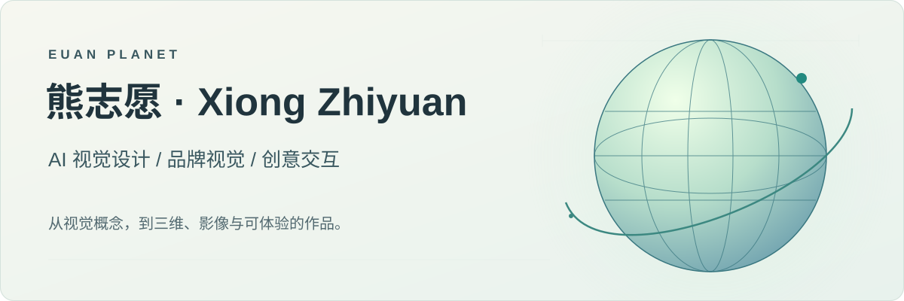
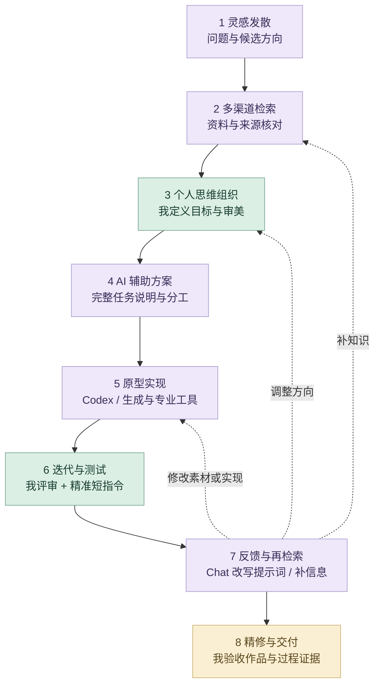

<p align="center">
<picture>
  <source media="(prefers-color-scheme: dark)" srcset="docs/media/github-banner-dark.svg">
  <source media="(prefers-color-scheme: light)" srcset="docs/media/github-banner-light.svg">
  
</picture>
</p>

# 熊志愿｜AI 视觉与创意设计作品集

我把视觉概念转化为品牌、三维、影像与交互作品。关注 AI 辅助的创作流程，也重视人工选择、结构细化和实际体验。

**[GitHub 个人主页](https://github.com/Zhiyuan-Xiong) · [GitHub 项目导航](https://zhiyuan-xiong.github.io/xiongzhiyuan-portfolio/) · [打开完整作品集](https://xiongzhiyuan-portfolio.pages.dev/) · [立即试玩《毒蘑菇》](https://zhiyuan-xiong.github.io/poisonous-mushrooms/) · [关于我与简历](https://xiongzhiyuan-portfolio.pages.dev/zh/about/) · [英文作品集](https://xiongzhiyuan-portfolio.pages.dev/en/)**

本科毕业于华中科技大学设计学院，现于 UCL Bartlett 攻读性能与交互设计硕士。求职方向：AI 设计、视觉设计、创意设计。

## 代表项目与我的贡献

| 项目 | 我的具体贡献 | 项目入口 |
| --- | --- | --- |
| **茶园物语** | 文化体验架构、玩法规则、视觉方向与迭代；AI 素材、Codex／Godot 原型和验收 | [工作流与材料说明](docs/projects/tea-garden-story.md) |
| **《毒蘑菇》** | 前期概念、场景与分镜；AI 素材生成与整理、Godot 小游戏搭建和体验验证；参与 MV 调色与视觉统一 | [查看](https://github.com/Zhiyuan-Xiong/poisonous-mushrooms) |
| **骨骸共生系统** | SPRING 品牌视觉与 Logo；Midjourney 图像探索、Tripo 3D 初始建模、ZBrush／Nomad 人工雕刻与首饰细化 | [查看](https://github.com/Zhiyuan-Xiong/spring-skeleton-collection) |
| **无垠的宇宙** | 参数化建模、交互编程与生成影像设计 | [查看](https://github.com/Zhiyuan-Xiong/infinite-cosmos) |
| **地震：数据转译** | Python 数据处理、参数映射与空间可视化 | [查看](https://github.com/Zhiyuan-Xiong/BARC0074-Digital-Skills-Report-Codebook-25097154) |
| **蜕变** | 模型处理、节点编程、声音映射与视觉合成 | [查看](https://github.com/Zhiyuan-Xiong/metamorphosis) |
| **饭搭子** | 产品概念、饮食记录与食宠 UX 流程、Godot 交互原型和 AI 照片工作流；进行中 | [查看](https://github.com/Zhiyuan-Xiong/fandazi) |

**[查看精选项目个人贡献](docs/个人贡献.md) · [GitHub 真实贡献与活动](https://github.com/Zhiyuan-Xiong)**

## 作品预览

<table><tr>
<td width="50%"><a href="https://github.com/Zhiyuan-Xiong/poisonous-mushrooms"></a><br><strong>《毒蘑菇》</strong><br>AI 素材工作流、可编辑 Godot 跑酷游戏与浏览器试玩。</td>
<td width="50%"><a href="https://github.com/Zhiyuan-Xiong/spring-skeleton-collection"></a><br><strong>骨骸共生系统</strong><br>SPRING 品牌视觉与骨骸首饰：AI 图像、辅助建模和人工细化。</td>
</tr><tr>
<td width="50%"><a href="docs/projects/tea-garden-story.md"></a><br><strong>茶园物语</strong><br>完整指令、分批素材、Godot 实现与精准反馈，连接可体验网页。</td>
<td width="50%"><a href="https://github.com/Zhiyuan-Xiong/metamorphosis"></a><br><strong>蜕变</strong><br>TouchDesigner 几何、粒子与实时声音响应。</td>
</tr></table>

## 我的 AI 工作方式

我先用完整的任务说明建立上下文：交代项目目标、参考资料、审美方向、实现约束、输出格式与验收标准，让 ChatGPT 和 Codex 理解要完成什么。得到初步方案或原型后，我再以精准的短指令逐轮控制修改，明确本轮改什么、保留什么，并对照实际结果继续判断。**完整指令建立方向，短指令控制细节，专业判断决定交付。**

<picture>
  <source media="(prefers-color-scheme: dark)" srcset="docs/media/ai-workflow-8steps-dark.svg">
  
</picture>

| 控制方式 | 我怎样使用 | 体现的能力 |
| --- | --- | --- |
| **完整任务说明** | 目标、参考、结构、风格、规格与验收一次交代清楚 | 把设计问题组织成可执行任务 |
| **精准短指令** | 在既有上下文中限定本轮修改对象、幅度和保留项 | 用审美判断控制局部结果 |
| **逐轮对照验收** | 看画面、运行原型，核对修改结果与已有约束 | 保持视觉一致性和专业可用性 |

<details>
<summary>展开八阶段流程与反馈路径</summary>



</details>

| 项目任务 | 我的 AI 策略 | 我掌握的质量判断 |
| --- | --- | --- |
| **茶园物语：完整设计系统** | Figma 基准 → 完整指令 → 分批生成 → Codex／Godot → 精准短指令迭代 | 风格、锚点、规则、原生 UI 与真实操作；[完整工作流](docs/projects/tea-garden-story.md) |
| **毒蘑菇：游戏资产与实现** | 权威参考约束 imagegen，多素材与 Codex／Godot 原型同步迭代 | 角色与风格一致性、透明素材、中文排字、玩法体验 |
| **骨骸共生：品牌与首饰** | Midjourney 发散 → Tripo 3D 初始形体 → 人工雕刻 | 系列语言、体块、佩戴结构和细节 |
| **无垠的宇宙：生成影像** | 参数化结构与粒子作为基础，ComfyUI 延展视觉 | 形态连续性、构图和运动节奏 |
| **Earthquake：多模态分析** | 用预训练表示解析数据，由我定义空间映射 | 数据来源、变量意义、映射解释和视觉结果 |
| **饭搭子：带 AI 的 UX** | 将识别、人工核对、贴纸生成与降级路径放入产品 | 用户控制、风格一致、等待状态与失败体验 |
| **作品集网站：数字交付** | Chat 梳理 → 我确定设计要求 → Codex 实现、检查与迭代 | 内容结构、页面审美、交互、类型和素材引用 |

**[完整八阶段方法、指令控制与精选迭代案例](docs/AI设计工作流.md)**

工具按任务选择：ChatGPT 与 Codex 用于研究组织和实现；Midjourney、Tripo 3D、ComfyUI、imagegen 用于图像与三维探索；即梦／Seedance 用于 AI 视频生成；专业软件负责人工细化。

### 这个网站怎样从设计要求形成原型

我提供作品素材、个人职责和视觉要求，由 Chat 辅助组织信息；我确定内容、页面层次与交互方向，再把任务交给 Codex 实现。通过实际页面评审与运行检查，继续迭代视觉、代码和内容，最后整理为中英文作品集、分项目仓库、中文个人主页和可在线体验的游戏。

| 控制环节 | 我提出或判断什么 | AI 协作与产出 |
| --- | --- | --- |
| 研究与内容 | 项目定位、个人贡献、阅读顺序和求职重点 | 结构化文案与项目索引 |
| 视觉与体验 | 色彩、封面、模型与粒子呈现、交互反馈 | Astro 组件、TypeScript 与 WebGL 原型 |
| 迭代与验证 | 实际页面是否符合审美和体验要求 | 类型、构建、浏览器与 5123 项本地引用检查 |
| 交付与复用 | 哪些项目进入精选、哪些资料保留归档 | 42 页双语网站、GitHub 仓库、源码与制作证据 |

## 求职项目索引

11 个精选项目已按项目整理。茶园物语提供公开案例与详细工作流，完整素材、工程和交接存放于独立私有仓库；其他项目沿用原有仓库。饭搭子为进行中的 UX 原型。

| 项目 | 类型 | 项目说明／仓库 | 完整案例 |
| --- | --- | --- | --- |
| 茶园物语 | AI 全流程协作／文化体验／游戏 UX | [公开工作流](docs/projects/tea-garden-story.md) · [私有资料库](https://github.com/Zhiyuan-Xiong/tea-garden-story-assets) | [案例与体验](https://xiongzhiyuan-portfolio.pages.dev/zh/work/tea-garden/) |
| 病名异化实验场 | XR／交互体验 · 协作项目 | [仓库](https://github.com/Zhiyuan-Xiong/the-big-bang-stigma) | [案例](https://xiongzhiyuan-portfolio.pages.dev/zh/work/stigma/) |
| 相亲营销嘉年华 | 交互叙事／三维空间 | [仓库](https://github.com/Zhiyuan-Xiong/dating-carnival) | [案例](https://xiongzhiyuan-portfolio.pages.dev/zh/work/dating-carnival/) |
| 《毒蘑菇》 | 音乐影像／商业协作 | [仓库](https://github.com/Zhiyuan-Xiong/poisonous-mushrooms) | [案例](https://xiongzhiyuan-portfolio.pages.dev/zh/work/poisonous-mushrooms/) |
| 饭搭子 | UX／产品设计 | [仓库](https://github.com/Zhiyuan-Xiong/fandazi) | [案例](https://xiongzhiyuan-portfolio.pages.dev/zh/works/?project=fandazi) |
| 机械文明计划 | 叙事向概念游戏场景设计 | [仓库](https://github.com/Zhiyuan-Xiong/nexus-mechanical-civilization) | [案例](https://xiongzhiyuan-portfolio.pages.dev/zh/work/nexus/) |
| 骨骸共生系统 | 品牌视觉／3D 首饰设计 | [仓库](https://github.com/Zhiyuan-Xiong/spring-skeleton-collection) | [案例](https://xiongzhiyuan-portfolio.pages.dev/zh/work/bone-series/) |
| 声学弹性 | Bartlett School 设计项目 · 协作装置 | [仓库](https://github.com/Zhiyuan-Xiong/sonic-elasticity) | [案例](https://xiongzhiyuan-portfolio.pages.dev/zh/work/sonic-elasticity/) |
| 无垠的宇宙 | 参数化空间／创意编程／生成影像 | [仓库](https://github.com/Zhiyuan-Xiong/infinite-cosmos) | [案例](https://xiongzhiyuan-portfolio.pages.dev/zh/work/infinite-cosmos/) |
| 地震：数据转译 | Bartlett School 设计项目 · 数据驱动设计 | [仓库](https://github.com/Zhiyuan-Xiong/BARC0074-Digital-Skills-Report-Codebook-25097154) | [案例](https://xiongzhiyuan-portfolio.pages.dev/zh/work/earthquake/) |
| 蜕变 | 创意编程／实时视听交互 | [仓库](https://github.com/Zhiyuan-Xiong/metamorphosis) | [案例](https://xiongzhiyuan-portfolio.pages.dev/zh/work/metamorphosis/) |

## 从这里开始

- 查看作品与影片：[在线作品集](https://xiongzhiyuan-portfolio.pages.dev/)。
- 实际体验：[毒蘑菇在线试玩](https://zhiyuan-xiong.github.io/poisonous-mushrooms/)、[游戏素材浏览](https://zhiyuan-xiong.github.io/poisonous-mushrooms/resources.html)。
- 阅读代码与工作流：从上方各项目入口进入。
- 查看完整网站源码：本仓库的 `src/`、`public/` 与 `scripts/`。

<details><summary>网站运行与技术说明</summary>

需要 Node.js 22.12 或以上、pnpm 11。

```sh
pnpm install --frozen-lockfile
pnpm dev
pnpm check
pnpm build
pnpm test
```

网站使用 Astro、TypeScript、CSS 与原生 WebGL；中英文页面共 42 页。已通过类型检查和 5123 个本地链接／素材引用检查。

</details>

## 联系与署名

[关于我、联系方式与双语简历](https://xiongzhiyuan-portfolio.pages.dev/zh/about/)。协作项目按案例中的个人职责说明展示；作品素材和第三方资源遵循各自授权。
