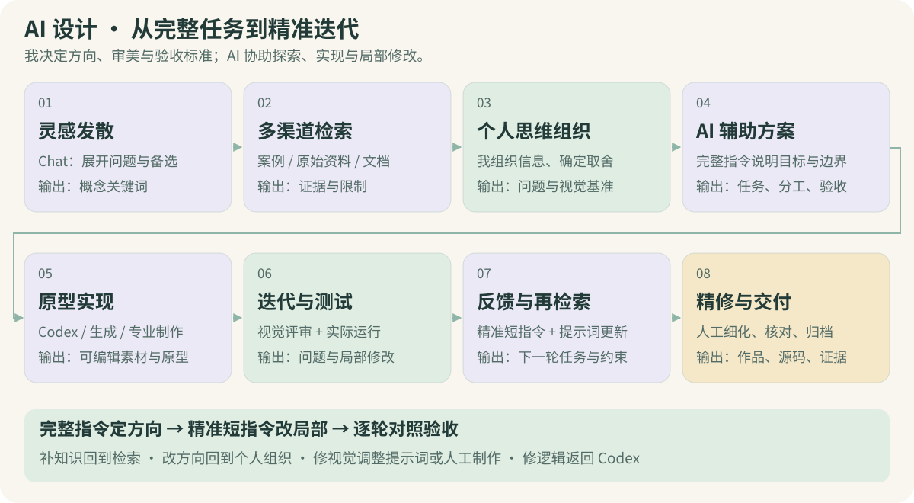
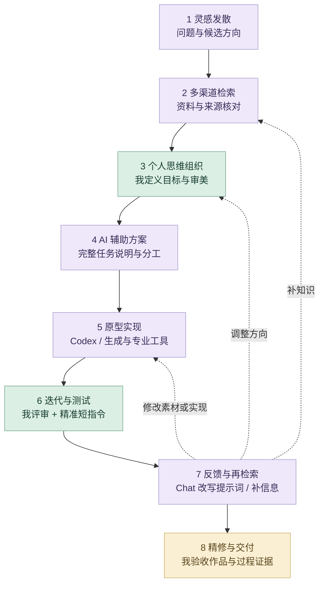

# 熊志愿｜AI 设计方法与项目策略

我先用完整的任务说明建立上下文：交代项目目标、参考资料、审美方向、实现约束、输出格式与验收标准，让 ChatGPT 和 Codex 理解要完成什么。得到初步方案或原型后，我再以精准的短指令逐轮控制修改，明确本轮改什么、保留什么，并对照实际结果继续判断。**完整指令建立方向，短指令控制细节，专业判断决定交付。**

## 八阶段设计循环

<picture>
  <source media="(prefers-color-scheme: dark)" srcset="media/ai-workflow-8steps-dark.svg">
  
</picture>

<details>
<summary>展开流程与反馈路径</summary>



</details>

每一轮都保留已确定的目标与审美基准。阶段可以往返：知识不足补检索，方向偏差回个人组织，视觉问题调整生成输入或人工制作，逻辑问题交给 Codex 修改并重新运行。

| 阶段 | 输入 | 具体操作与我的判断 | 输出与验收 |
| --- | --- | --- | --- |
| **1. 灵感发散** | 项目背景、问题与创作立场 | ChatGPT 展开视角和候选；我选择有价值的方向 | 概念关键词与候选；判断是否回应目标 |
| **2. 多渠道检索** | 候选方向与待确认的问题 | 比较案例、原始资料与技术文档；我核对来源和适用条件 | 参考与限制；重要结论有依据 |
| **3. 个人思维组织** | 研究、参考和现有成果 | 我组织问题、优先级、审美与专业约束，AI 辅助归纳 | 设计 brief、视觉基准与判断标准 |
| **4. AI 辅助方案** | 明确的 brief 与完整指令 | 拆分任务、比较方案与工具；我确定分工、边界和验收 | 可执行任务及输入输出规格 |
| **5. 原型实现** | 参考、任务与输出要求 | Codex、生成工具与专业软件按任务协作；我筛选和连接结果 | 可编辑素材、模型或运行原型 |
| **6. 迭代与测试** | 实际产出、截图、录屏与测试 | 我评审画面与体验，用精准短指令控制局部；Codex 修改检查 | 新版本和问题清单；对照本轮目标 |
| **7. 反馈与再检索** | 具体偏差、保留项与下一步目标 | ChatGPT 改写提示词，必要时补检索；我决定返回哪一环节 | 新任务与约束；再实现、再评审 |
| **8. 精修与交付** | 通过评审的产出与过程材料 | 我完成人工精修和验收，AI 协助组织文件与说明 | 作品、源码、体验入口和精选过程证据 |

## 完整指令与短指令怎样配合

| 控制方式 | 我怎样使用 | 体现的能力 |
| --- | --- | --- |
| **完整任务说明** | 目标、参考、结构、风格、规格与验收一次交代清楚 | 把设计问题组织成可执行任务 |
| **精准短指令** | 在既有上下文中限定本轮修改对象、幅度和保留项 | 用审美判断控制局部结果 |
| **逐轮对照验收** | 看画面、运行原型，核对修改结果与已有约束 | 保持视觉一致性和专业可用性 |


初始指令交代完整上下文，后续短指令依赖已经明确的目标、参考与约束。每轮反馈聚焦一个具体问题，更新局部规则，让前一轮已成立的设计可以继续积累。

```text
初始任务：目标与对象 / 权威参考 / 内容结构与审美 /
         必须保留与允许修改 / 输出规格 / 验收方式。
后续反馈：修改对象 + 希望达到的状态 + 必须保留的内容。
验收结果：对照画面、原型或数据，确认变化，再决定下一轮。
```

例如“改成五秒”放在既有动画上下文中，含义是延长时间并维持原画风格与动作关系；“改为线性流程图”放在既有 UX 框架中，含义是调整表达形式并保留实际用户路径。短指令的准确性来自清楚的上下文与我的持续判断。

## 四个精选迭代案例

| 项目与初始任务 | 后续精准控制 | 产出与验收 |
| --- | --- | --- |
| **茶园物语**：文化体验、Figma 基准、完整规格与分批任务 | 保留画风与身份 → 用可见边界和脚底锚点接入 → 统一五层 14 位与五日规则 → 分离 UI 文字和状态 | 图像检查、坐标与实机截图、规则及存档记录；[八阶段工作流与三次决策](projects/tea-garden-story.md) |
| **毒蘑菇 UI 动画**：三张原画、动作顺序、关键帧、时长与风格保留 | 卡片首帧可见 → 改成 5 秒并增强植物运动 → 虚线随点亮生长 | 三段 5 秒视频、关键帧总览、动画参数与解码检查 |
| **饭搭子 UX 框架**：八页 SVG、1920 × 1080、可编辑文本、栅格与页面内容 | 参考已有 Figma → 线性流程图 → 补贴纸手账与后续建议 | 可编辑页面和图标；与 Godot 原型核对，区分已有与待验证状态 |
| **作品集入场体验**：页面与粒子交互需求 | 根据录屏发现重复标题与方形底图，要求调整真实加载过程和过渡 | 统一真实首帧，修改资源加载与淡入；检查移动端和重复刷新 |

[动画迭代证据](https://github.com/Zhiyuan-Xiong/poisonous-mushrooms/tree/main/process/mv-animation) · [UX 可编辑框架](https://github.com/Zhiyuan-Xiong/fandazi/tree/main/process/ux-layout) · [入场修复记录](entry-flash-fix-2026-10-04.md)

## 不同项目采用不同的 AI 策略

| 任务与项目 | 为什么选择这条路线 | 我保留的设计判断 |
| --- | --- | --- |
| **茶园物语 · 完整设计系统** | 用 Figma 与工艺资料确立基准，分批生成独立资产；Codex 连接 Godot，并用精准短指令分别修正视觉、空间和行为 | 文化转译、低压力规则、五日节奏、原始标识、色彩与锚点；透明检查和场景可用分开验收 |
| **毒蘑菇 · 资产与游戏** | 参考约束 imagegen，Codex 连接 Godot；动画局部改动用参数和时序控制 | 角色服装、比例、色彩、原画保留、玩法与视觉反馈 |
| **骨骸共生 · 品牌与三维** | Midjourney 发散、Tripo 3D 起形，再用 ZBrush／Nomad 人工雕刻 | 系列语言、体块、连接、表面细节与身体关系 |
| **无垠的宇宙 · 生成影像** | 参数化模型与粒子提供结构，ComfyUI 扩展同一视觉世界 | 几何可辨识、构图、动态连续与节奏 |
| **Earthquake · 多模态分析** | 图像、文本与地球物理变量分别表示，再融合并转为人工设计映射 | 来源与对齐、变量含义、映射解释和空间可读性 |
| **饭搭子 · 产品 UX** | 对话组织研究，Codex 做可编辑框架与原型，识别与生成进入可确认路径 | 实际流程、插画风格、人工核对、等待状态与失败体验 |
| **其他设计项目 · 数字案例** | 原作品的专业制作与团队职责保留，Codex 辅助当前网页说明和交互 | 原创立场、信息结构、视觉层级、观看顺序和署名 |

## 工具与专业质量

| 环节 | 工具与作用 | 我的验收重点 |
| --- | --- | --- |
| 研究、组织与指令 | ChatGPT：发散、信息比较、方案推演与提示词改写 | 来源、逻辑、问题结构与任务边界 |
| 原型与迭代 | Codex：素材组织、代码实现、修改、运行与检查 | 实际效果、状态、交互与已有约束 |
| 图像与三维探索 | Midjourney、Tripo 3D、ComfyUI、imagegen | 参考一致性、形态、色彩和可用格式 |
| **AI 视频生成** | **即梦／Seedance**：基于文本与参考探索动态画面 | 主体连续性、动作、镜头、时长与画面节奏 |
| 人工视觉与形体细化 | Photoshop、Illustrator、Figma、Blender、C4D、Rhino、ZBrush、Nomad | 构图、层级、材质、结构与细节 |
| 交互与数据 | Godot、TouchDesigner、Processing、Grasshopper、Python | 体验、参数、数据意义与运行结果 |

Seedance 的视频生成定位可参见[官方模型介绍](https://seed.bytedance.com/en/seedance)。具体项目沿用各自的制作证据：毒蘑菇本页精选 UI 动画记录为 imagegen 背景修补与 Codex 动画实现。

## 茶园物语怎样扩展这套方法

这个项目把 AI 使用从单项素材扩展到完整设计系统：**文化与交互资料 → 我定义体验和审美 → 完整任务与规格 → 分批生成和 Godot 实现 → 精准短指令调整 → 画面与功能验证 → 资料交接和网页体验**。

我按问题选择返工环节：风格偏差改提示词，落地与遮挡问题改锚点和布局，规则与操作问题改数据或代码。既保留原始 Figma 构图与书法标识，也让 UI 文字、状态与交互可以独立控制。详细阶段输入输出与精选迭代见[茶园物语工作流](projects/tea-garden-story.md)。

## 过程证据与进一步阅读

- **茶园物语**：[八阶段流程图、提示词结构与质量门槛](projects/tea-garden-story.md)、[逐场景前后版本与核心流程体验](https://xiongzhiyuan-portfolio.pages.dev/zh/work/tea-garden/)。
- **毒蘑菇**：[完整工作流](https://github.com/Zhiyuan-Xiong/poisonous-mushrooms/blob/main/工作流.md)、[制作提示词](https://github.com/Zhiyuan-Xiong/poisonous-mushrooms/blob/main/制作提示词.json)、[运行验证](https://github.com/Zhiyuan-Xiong/poisonous-mushrooms/tree/main/verification)。
- **骨骸共生系统**：[工具分工、形体精修与品牌控制](https://github.com/Zhiyuan-Xiong/spring-skeleton-collection/blob/main/工作流.md)。
- **无垠的宇宙**：[结构、粒子与 ComfyUI 过程](https://github.com/Zhiyuan-Xiong/infinite-cosmos/blob/main/工作流.md)。
- **Earthquake**：[多模态、融合与映射](https://github.com/Zhiyuan-Xiong/BARC0074-Digital-Skills-Report-Codebook-25097154/blob/main/工作流.md)。
- **饭搭子**：[研究、可编辑框架与产品状态](https://github.com/Zhiyuan-Xiong/fandazi/blob/main/工作流.md)。
- **作品集网站**：[源码](../src/)、[检查脚本](../scripts/)、[个人贡献](个人贡献.md)、[提交记录](https://github.com/Zhiyuan-Xiong/xiongzhiyuan-portfolio/commits/main)。

每个项目只选能解释设计决策的过程材料。工具链依据作者说明和现有文件整理；协作项目按个人职责展示，进行中的原型标注当前范围。

[茶园物语公开项目仓库、完整交接与实机画面](https://github.com/Zhiyuan-Xiong/tea-garden-story-assets)
