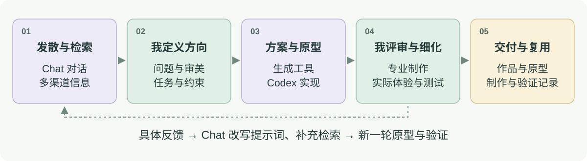
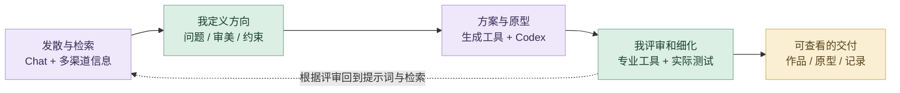

# 熊志愿｜AI 设计方法与项目策略

我把 AI 放进从研究到交付的完整设计过程中：用对话扩展问题，用检索补足信息，用自己的思考组织方案，再通过生成工具、专业软件与 Codex 实现和迭代。我的判断贯穿方向、审美、技术约束与最终体验。

## 从灵感到交付的循环

<picture>
  <source media="(prefers-color-scheme: dark)" srcset="media/ai-workflow-dark.svg">
  
</picture>

<details>
<summary>展开查看可交互流程图</summary>



</details>

绿色节点代表我的判断与专业细化，紫色代表 AI 协作，金色代表可以查看和验证的交付。实际项目会在视觉、代码、数据或制作环节之间多次往返。

| 阶段 | 我怎样使用 AI | 我负责什么 | 阶段产出 |
| --- | --- | --- | --- |
| **1. 发散灵感** | 用 Chat 对话展开角度、备选情境和表现方式 | 提出问题与创作立场，选出值得研究的方向 | 候选方向、概念关键词 |
| **2. 多渠道检索** | 围绕设计案例、原始资料与官方技术文档补充信息 | 比较来源、适用场景与实际限制，核对结论 | 参考资料、需求与限制 |
| **3. 个人思维组织** | 让 AI 协助归纳、比较和解释复杂资料 | 建立问题结构、视觉语言和评审标准 | 设计 brief、优先级、风格基准 |
| **4. 辅助方案设立** | 把目标拆成图像、模型、数据或交互任务，推演备选 | 决定采用的方案及人机分工 | 方案、输入材料、任务清单 |
| **5. 形成原型** | 用 imagegen、Midjourney、Tripo 3D、ComfyUI 或 Codex 连接素材与实现 | 控制参考、结构、状态与输出格式，并在专业软件中制作 | 可编辑素材、三维基础、交互原型 |
| **6. 迭代与测试** | 用 Codex 修改和检查实现，整理测试与运行反馈 | 评审审美、专业可用性和真实体验，决定是否通过 | 截图、测试结果、问题清单 |
| **7. 返回对话与检索** | 把具体问题带回 Chat 改写提示词，检索补足缺失知识 | 判断该重做方向、改输入、修代码还是人工细化 | 新提示词、新约束、新一轮原型 |
| **8. 整理交付与复用** | 协助组织文件、过程说明、源码和展示入口 | 核对完整性、个人职责和最终质量 | 作品、可体验原型、流程证据 |

## 不同的新项目，采用不同的 AI 策略

| 任务类型 | 项目 | 为什么这样使用 AI | 由我把控的关键 |
| --- | --- | --- | --- |
| **一致性资产与游戏实现** | 毒蘑菇 | 既要多素材快速探索，也要角色、动画与玩法保持同一风格 | 角色与色彩约束、透明素材、交互状态、实际试玩 |
| **品牌与三维产品** | 骨骸共生系统 | 图像探索与初始模型能加快早期尝试，专业雕刻决定最终形态 | 品牌一致性、体块、佩戴关系与细节 |
| **参数化与生成影像** | 无垠的宇宙 | 先用模型提供结构，再让生成式影像扩展同一世界 | 形态连续性、构图、运动和影像节奏 |
| **多模态研究与空间生成** | Earthquake | 图像、文本和地球物理数据需要不同表示与融合方法 | 数据对齐、变量含义、空间映射与视觉解释 |
| **带 AI 的产品 UX** | 饭搭子 | AI 识别与生成需要进入用户能理解、核对和继续使用的路径 | 人工确认、视觉基准、结果状态与失败降级 |
| **数字交互与作品展示** | 作品集网站，以及各案例数字呈现 | Codex 将设计资料组织为页面、交互与可检查实现 | 信息结构、页面审美、交互效果、运行与链接检查 |

## 怎样让 AI 产出可控且精良

| 我控制的内容 | 具体方法 | 真实例子 |
| --- | --- | --- |
| **视觉方向** | 在生成前建立参考、色彩、比例、构图与风格基准 | 毒蘑菇角色参考限定服装、轮廓、线条和色块 |
| **修改范围** | 说明哪些必须保留、哪些允许改变，将大问题拆成局部修改 | UI 徽章只移除文字，保留图形，再使用 Godot 原生排字 |
| **形体与结构** | 把 AI 初始模型放回专业工具进行人工雕刻和结构细化 | Tripo 3D → ZBrush／Nomad → 首饰与佩戴渲染 |
| **数据与逻辑** | 定义变量、状态、映射与验收条件，检查实际输出 | Earthquake 的融合 CSV 和设计映射表；游戏的玩法逻辑 |
| **审美评审** | 比较轮廓、层次、材质、动线、节奏和系列一致性 | 骨骸系列、粒子影像及场景视觉 |
| **真实体验** | 通过运行、试玩、截图与测试检查可用性 | 毒蘑菇的浏览器、键盘、触控和 Godot 测试 |
| **反馈粒度** | 描述观察到的问题、期望结果和修改边界，再交给 Chat 或 Codex | 将文字不稳定、角色不一致、状态失败拆成不同任务 |

## 我的提示词与任务组织方式

我会把一个任务拆为目标、参考、约束、输出和验收，而不是只提供风格形容词。

```text
项目背景与目标：为谁设计，希望解决什么问题。
权威参考：哪个输入决定角色、风格、结构或原始事实。
必须保留：轮廓、比例、色彩、服饰、数据字段或既有状态。
允许修改：本次只改变什么，修改到什么程度。
实现约束：尺寸、透明通道、帧序列、文件结构或接口状态。
输出格式：可编辑文件、结构化数据、素材或运行原型。
验收条件：我会如何比对、运行、检查与决定是否通过。
本轮反馈：观察到的问题、证据与下一轮修改重点。
```

毒蘑菇的提示词已经保留角色权威参考、精确编辑范围、指定配色、透明通道与帧序列要求。骨骸项目将图像、三维基础与人工雕刻衔接；Earthquake 用映射表保留设计变量的意义；饭搭子用人工核对与降级路径保留用户控制。

## 作品集网站：从设计要求到可运行交付

| 阶段 | 我的要求与 AI 协作 | 可以查看的结果 |
| --- | --- | --- |
| **内容与方向** | 我提供作品资料、设计偏好、求职定位和个人职责，Chat 协助梳理 | 项目文案、中文个人介绍与项目索引 |
| **信息和视觉结构** | 我确定主页、作品导航、案例章节和双语内容，Codex 实现结构 | 42 页中英文作品集 |
| **交互与实现** | 将粒子、模型、声音与导航要求拆成组件和交互任务 | Astro、TypeScript、WebGL 与案例组件 |
| **人工评审与迭代** | 我根据页面效果继续调整封面、排版、视觉层次和说明 | 亮暗封面、代表作品、职责与 AI 策略 |
| **运行与检查** | Codex 执行类型、构建、素材引用和浏览器验证，并修正问题 | 类型检查、构建及 5123 项本地引用检查 |
| **公开交付** | 我选择求职展示项目，整理 GitHub 主页、分项目仓库和在线体验 | 个人主页、作品集、在线小游戏和中文制作记录 |

[网站源码](../src/) · [网站检查与部署脚本](../scripts/) · [个人贡献说明](个人贡献.md) · [实际提交记录](https://github.com/Zhiyuan-Xiong/xiongzhiyuan-portfolio/commits/main)

## 工作流证据

- **毒蘑菇**：[制作提示词](https://github.com/Zhiyuan-Xiong/poisonous-mushrooms/blob/main/制作提示词.json)、[角色生成记录](https://github.com/Zhiyuan-Xiong/poisonous-mushrooms/blob/main/source_assets/runner/生成提示词.json)、[测试和运行](https://github.com/Zhiyuan-Xiong/poisonous-mushrooms/tree/main/verification)。
- **骨骸共生系统**：[完整工作流](https://github.com/Zhiyuan-Xiong/spring-skeleton-collection/blob/main/工作流.md)。工具依据作者补充；现有仓库展示品牌与渲染，原生模型和原提示词仍待归档。
- **Earthquake**：[Notebook 与映射证据](https://github.com/Zhiyuan-Xiong/BARC0074-Digital-Skills-Report-Codebook-25097154)。
- **无垠的宇宙**：[模型、粒子与 ComfyUI 过程](https://github.com/Zhiyuan-Xiong/infinite-cosmos)。
- **饭搭子**：[可编辑原型与服务代码](https://github.com/Zhiyuan-Xiong/fandazi)。产品进行中，真实付费 AI 端到端质量仍在验证。

这里结合作者说明的通用 AI 方法、已保存提示词、代码、数据与案例资料组织工作流。原项目制作与本次 AI 辅助数字呈现分别说明，协作职责以案例署名为准。
