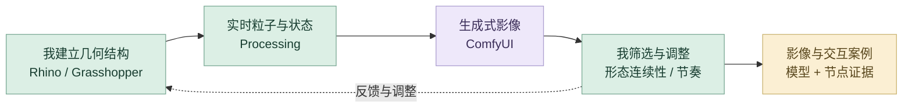
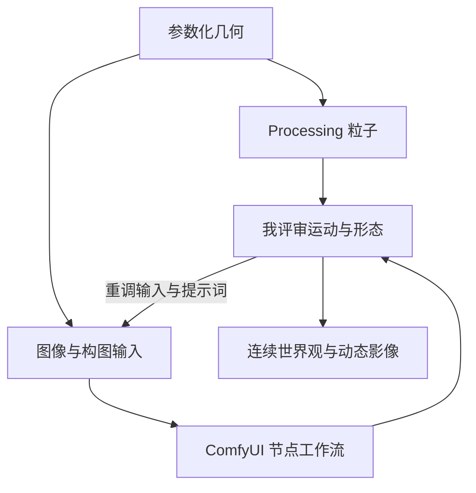

# 无垠的宇宙｜详细 AI 设计工作流

先建立自己控制的参数化形态与粒子系统，再用生成式影像扩展视觉世界。几何和交互提供结构约束，AI 负责演化外观，我决定形态连续性与动态节奏。

## 策略图

## 工具怎样分工

Rhino／Grasshopper 建立参数化模型；Processing 构建点云与粒子反馈；ComfyUI 连接图像与视频生成。Chat 与 Codex 参与当前数字案例的结构、网页呈现与迭代。

## 指令与任务组织

我先用完整的任务说明建立上下文：交代项目目标、参考资料、审美方向、实现约束、输出格式与验收标准，让 ChatGPT 和 Codex 理解要完成什么。得到初步方案或原型后，我再以精准的短指令逐轮控制修改，明确本轮改什么、保留什么，并对照实际结果继续判断。**完整指令建立方向，短指令控制细节，专业判断决定交付。**

## 八阶段输入与输出

| 阶段 | 输入 | AI 协作与我的控制 | 输出与验收 |
| --- | --- | --- | --- |
| **1. 灵感发散** | 宇宙、形态演化、粒子概念 | 对话协助整理探索方向与表达关系；我决定几何结构与视觉世界 | 概念方向；确保结构可延续 |
| **2. 多渠道检索** | 参数化、粒子与生成过程资料 | 整理工具链和已有工作流信息；我核对模型到图像、影像的连接条件 | 参考与技术关系；缺失信息补检索 |
| **3. 个人思维组织** | Rhino／Grasshopper 形态资料 | 协助归纳阶段与变量；我组织形态规则、构图与动态层次 | 结构基准；保持几何可辨识 |
| **4. AI 辅助方案** | 结构基准与影像目标 | 组织粒子表现与 ComfyUI 生成任务；我决定参数化结构如何约束生成 | 方案与输入；核对各工具的责任 |
| **5. 原型实现** | 参数化模型、粒子与输入图像 | ComfyUI 连接提示词与生成节点；专业工具完成结构，筛选 AI 视觉候选 | 模型、粒子、影像候选；检查形态连续 |
| **6. 迭代与测试** | 生成帧、动态序列与录屏 | 当前数字呈现由 Codex 辅助实现和检查；我评审构图、运动、层次与节奏 | 选定序列；对照原结构和视觉主题 |
| **7. 反馈与再检索** | 失去结构或动态衔接不佳的部分 | 对话辅助调整任务；必要时补工作流信息；结构问题回参数，外观问题回生成输入 | 修订参数或生成方案；局部比较 |
| **8. 精修与交付** | 模型分析、节点记录与输出影像 | 整理中文案例和可查看证据；我核对模型、粒子与影像的过程关系 | 结构分析、代码截图、工作流图与影像 |

## 精选决策：先控制结构，再扩展影像

我将参数化模型与粒子系统作为形态基准，再用 ComfyUI 扩展生成视觉。评审时对照结构、生成帧与动态序列，分别判断需要修改几何、生成输入还是展示实现。

| 判断对象 | 我控制什么 | 返回的环节 |
| --- | --- | --- |
| 基础形态 | 几何关系与参数是否支持设计概念 | Rhino／Grasshopper |
| 生成影像 | 结构可辨识、构图连续、运动节奏一致 | ComfyUI 输入与节点 |
| 招聘者的浏览体验 | 过程关系、影像入口与网页衔接清楚 | 当前 Codex 数字案例 |

原 ComfyUI 制作由节点截图和输出帧说明，当前网页实现单独保留。

## 审美与专业质量

| 质量维度 | 我如何控制 | 可查看产出 |
| --- | --- | --- |
| **结构可控** | 让模型和参数化关系成为图像与粒子的共同输入。 | 同一形态的多种视觉演化 |
| **审美统一** | 评审配色、构图、空间层次与世界观是否连贯。 | 相互关联的一组影像 |
| **动态连续** | 比较粒子状态与生成影像的运动节奏。 | 交互录屏与动态成果 |

## 迭代路线

## 过程证据

[参数化装配](https://raw.githubusercontent.com/Zhiyuan-Xiong/xiongzhiyuan-portfolio/main/public/media/cosmos/model-assembly-large.webp) · [Processing 代码](https://raw.githubusercontent.com/Zhiyuan-Xiong/xiongzhiyuan-portfolio/main/public/media/cosmos/processing-code-large.webp) · [ComfyUI 图像工作流](https://raw.githubusercontent.com/Zhiyuan-Xiong/xiongzhiyuan-portfolio/main/public/media/cosmos/comfy-image-workflow-large.webp) · [ComfyUI 视频工作流](https://raw.githubusercontent.com/Zhiyuan-Xiong/xiongzhiyuan-portfolio/main/public/media/cosmos/comfy-video-workflow-large.webp) · [生成输出](https://raw.githubusercontent.com/Zhiyuan-Xiong/xiongzhiyuan-portfolio/main/public/media/cosmos/ai-outcome-one.webp)

[项目总览](infinite-cosmos.md) · [完整 AI 设计方法](https://github.com/Zhiyuan-Xiong/xiongzhiyuan-portfolio/blob/main/docs/AI设计工作流.md)
