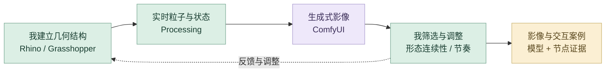
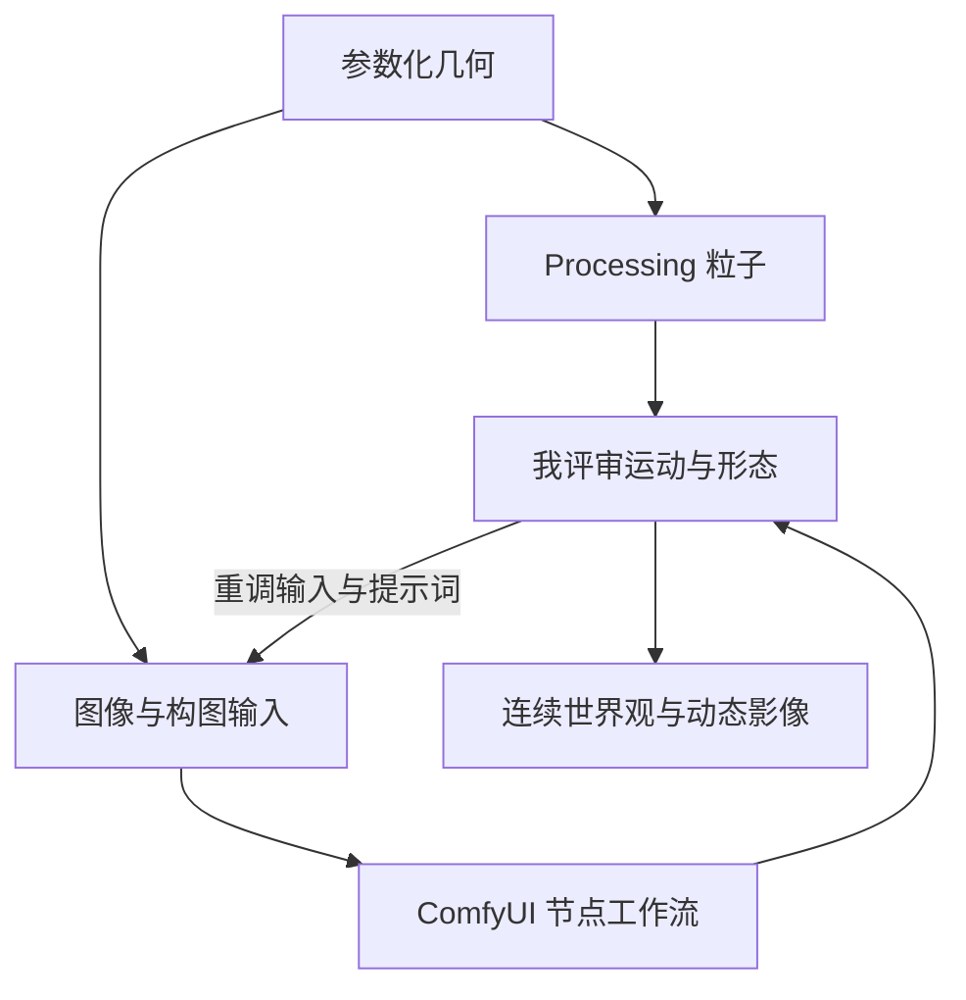

# 无垠的宇宙

Rhino、Grasshopper、Processing 与 ComfyUI 的跨工具创作。

**[完整设计案例](https://xiongzhiyuan-portfolio.pages.dev/zh/work/infinite-cosmos/) · [求职作品总入口](https://github.com/Zhiyuan-Xiong/xiongzhiyuan-portfolio)**

## 项目目标

以多元宇宙与未来世界观为起点，将参数化几何、粒子交互和生成式影像连接为一条连续的创作路径。通过生物形态与机械结构的组合，构建一个由不同时间线相互支撑、不断生长和变化的混合生态空间。

## 我的贡献

参数化建模、交互编程与生成影像设计

完成阶段：概念模型、粒子交互与生成影像

现有产出：参数化分析、Rhino 模型、Processing 粒子交互、ComfyUI 工作流与动态影像

## 我的 AI 策略与迭代工作流

先建立自己控制的参数化形态与粒子系统，再用生成式影像扩展视觉世界。几何和交互提供结构约束，AI 负责演化外观，我决定形态连续性与动态节奏。

### 从灵感到交付

| 阶段 | AI 策略与我的判断 |
| --- | --- |
| **1. 世界观与形态发散** | 从多元宇宙、生物形态与机械结构出发，对不同时间线中的形态关系进行探索。先确定空间如何生长和变化，再决定哪类生成视觉能够支持这个世界观。 |
| **2. 研究与组织结构参考** | 比较生物结构、模型装配、参数化分析与粒子运动，把参考整理为可实现的形态关系。已有模型分析与过程图用于说明选择依据。 |
| **3. 我建立参数化形态** | 在 Rhino 与 Grasshopper 中定义几何、组合关系与参数化空间。模型承担后续粒子与生成影像的结构基础，让视觉探索始终围绕同一套形态。 |
| **4. Processing 转为交互反馈** | 将几何连接到点云、粒子、藤蔓与烟花反馈，组织不同运动状态。比较参数变化后的视觉密度、层次与节奏。 |
| **5. ComfyUI 生成图像与影像** | 以参数化视觉作为输入，将模型、提示词、输入图像与采样节点连接成工作流。通过图像和视频探索同一形态的不同视觉演化，而不是脱离模型另做一组概念图。 |
| **6. 人工控制连续性与节奏** | 评审生成结果是否保留主要形态、空间关系与世界观；调整构图、颜色和动态节奏。将偏离结构的结果反馈到输入与提示词阶段。 |
| **7. Codex 组织可体验展示** | 当前数字案例保留模型导出的几何与点云，由 Codex 辅助组织网页渲染、交互状态和资料入口。我通过实际页面检查视觉与交互是否准确传达原项目。 |
| **8. 流程证据与影像交付** | 整理模型分析、Processing 源码截图、ComfyUI 节点截图、录屏和生成影像。当前 ComfyUI 过程以工作流图像记录展示。 |

### 审美、专业制作与质量控制

| 质量维度 | 我如何控制 | 可查看产出 |
| --- | --- | --- |
| **结构可控** | 让模型和参数化关系成为图像与粒子的共同输入。 | 同一形态的多种视觉演化 |
| **审美统一** | 评审配色、构图、空间层次与世界观是否连贯。 | 相互关联的一组影像 |
| **动态连续** | 比较粒子状态与生成影像的运动节奏。 | 交互录屏与动态成果 |

### 反馈如何改变下一步

### 工具分工

Rhino／Grasshopper 建立参数化模型；Processing 构建点云与粒子反馈；ComfyUI 连接图像与视频生成。Chat 与 Codex 参与当前数字案例的结构、网页呈现与迭代。

**过程证据：** [参数化装配](https://raw.githubusercontent.com/Zhiyuan-Xiong/xiongzhiyuan-portfolio/main/public/media/cosmos/model-assembly-large.webp) · [Processing 代码](https://raw.githubusercontent.com/Zhiyuan-Xiong/xiongzhiyuan-portfolio/main/public/media/cosmos/processing-code-large.webp) · [ComfyUI 图像工作流](https://raw.githubusercontent.com/Zhiyuan-Xiong/xiongzhiyuan-portfolio/main/public/media/cosmos/comfy-image-workflow-large.webp) · [ComfyUI 视频工作流](https://raw.githubusercontent.com/Zhiyuan-Xiong/xiongzhiyuan-portfolio/main/public/media/cosmos/comfy-video-workflow-large.webp) · [生成输出](https://raw.githubusercontent.com/Zhiyuan-Xiong/xiongzhiyuan-portfolio/main/public/media/cosmos/ai-outcome-one.webp)

[阅读详细工作流与提示词组织方法](infinite-cosmos-工作流.md) · [我的完整 AI 设计方法](https://github.com/Zhiyuan-Xiong/xiongzhiyuan-portfolio/blob/main/docs/AI设计工作流.md)

## 工作流与成果证据

<table><tr><td width="50%"> ComfyUI：模型、提示词、输入图像和采样节点</td><td width="50%"> 生成影像输出帧</td></tr></table>

[查看视频生成工作流](https://raw.githubusercontent.com/Zhiyuan-Xiong/xiongzhiyuan-portfolio/main/public/media/cosmos/comfy-video-workflow-large.webp) · [查看 Processing 源码截图](https://raw.githubusercontent.com/Zhiyuan-Xiong/xiongzhiyuan-portfolio/main/public/media/cosmos/processing-code-large.webp) · [查看参数化模型装配](https://raw.githubusercontent.com/Zhiyuan-Xiong/xiongzhiyuan-portfolio/main/public/media/cosmos/model-assembly-large.webp)

## 仓库内容

- [media/](https://raw.githubusercontent.com/Zhiyuan-Xiong/xiongzhiyuan-portfolio/main/public/media/)：项目公开影像、图像与交互数据。
- [images/](https://raw.githubusercontent.com/Zhiyuan-Xiong/xiongzhiyuan-portfolio/main/public/images/)：作品集封面与不同尺寸展示图。
- [site-source/](https://github.com/Zhiyuan-Xiong/xiongzhiyuan-portfolio/tree/main/src/)：对应案例文案、页面组件与相关交互实现。
- [case-data.json](https://github.com/Zhiyuan-Xiong/xiongzhiyuan-portfolio/blob/main/src/data/site.ts)：项目目标、职责、章节与产出信息。

## 查看与使用

GitHub 中可直接浏览图像、GIF、文案与实现文件。完整交互与影像观看入口为顶部的在线案例。网页组件的完整构建环境位于 [作品集总仓库](https://github.com/Zhiyuan-Xiong/xiongzhiyuan-portfolio)。

## 署名与使用

作品素材用于个人设计展示。协作项目以案例中的职责说明为准；字体、引擎和第三方资料遵循各自授权。未经许可，不将作品素材用于转载或商业用途。
