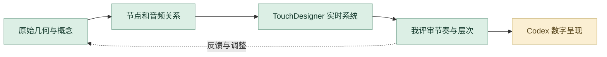

# 蜕变｜详细设计与 AI 协作工作流

把声音、几何、粒子与视觉合成组织成持续变化的体验。我掌握实时视听的节奏与层次，AI 协作主要帮助当前案例的结构复盘、技术表达和网页交互实现。

## 1. 建立声音与形态的概念

从蝴蝶形骨骸模型出发，明确“蜕变”如何通过生成、扰动与回流表现。把几何、粒子与液态背景看作同一个视听系统，而不是独立特效。

## 2. 整理节点与信号关系

对照原节点网络、阶段演进和声音反应序列，梳理输入、分析、放大、平滑及视觉输出。AI 辅助把复杂网络整理成可解释的步骤；原节点关系和专业判断由我核对。

## 3. 专业工具建立实时系统

在 TouchDesigner 中连接几何、粒子反馈、声音频段与合成关系。调整声音对湍动、缩放和视觉层次的影响，保留五阶段演进与实时影像。

## 4. Codex 转为可浏览交互

当前作品集通过 Codex 辅助组织声音交互、模型数据和网页渲染。我确定展示的状态、说明与入口，使招聘者可以理解原项目如何从模型演进到实时系统。

## 5. 我检查动态表达

评审响应幅度、密度、辉光、画面层次和阶段衔接，并对照录屏与网页表现。追求可读的节奏与形态变化，避免只有高强度效果却无法解释声音关系。

## 6. 以问题推动再次迭代

把“反应不明显”“层次过密”或“解释不清”分别转成参数、视觉或说明任务，再回到节点、Chat 对话或 Codex 页面迭代。最终保留过程序列、节点图和可体验案例。

## 审美与专业评审

| 评审维度 | 我的专业判断 |
| --- | --- |
| **视听关系** | 声音变化与粒子、形态之间有明确对应。 |
| **审美层次** | 比较密度、辉光、色彩和背景的主次。 |
| **过程表达** | 节点网络、五阶段和最终影像能够相互对照。 |

## 操作、输入输出与指令控制

我先用完整的任务说明建立上下文：交代项目目标、参考资料、审美方向、实现约束、输出格式与验收标准，让 ChatGPT 和 Codex 理解要完成什么。得到初步方案或原型后，我再以精准的短指令逐轮控制修改，明确本轮改什么、保留什么，并对照实际结果继续判断。**完整指令建立方向，短指令控制细节，专业判断决定交付。**

| 操作阶段 | 输入 | 我的控制与 AI 协作 | 输出与验收 |
| --- | --- | --- | --- |
| 建立方向 | 模型、节点网络、声音与演进序列 | 我定义设计目标，AI 辅助当前资料整理 | 明确主题与范围，核对原资料 |
| 组织方案 | 研究、参考与既有成果 | 我决定结构、视觉与专业约束 | 方案与任务；检查逻辑是否成立 |
| 专业制作 | 明确的设计方案 | 原作依照专业工具和团队分工完成 | 模型、场景或体验；由我核对效果 |
| 数字原型 | 作品资料、完整页面说明 | Codex 辅助当前网页与交互呈现 | 可浏览案例；核对原项目表达 |
| 精准迭代 | 页面、录屏与具体问题 | 短指令限定 声音响应、密度、辉光与过渡衔接 | 局部更新；与前轮和原参考对照 |
| 验收交付 | 通过评审的内容与实现 | 我核对完整性、职责和观看顺序 | 节点关系、实时视觉与网页交互 |

本段说明原项目的专业制作与当前 AI 辅助数字案例整理。修改前保留已有方案，以明确的修改对象和验收条件控制本轮结果。

## 过程证据

[完整节点网络](https://raw.githubusercontent.com/Zhiyuan-Xiong/xiongzhiyuan-portfolio/main/public/media/metamorphosis/operator-network-large.webp) · [演进过程](https://raw.githubusercontent.com/Zhiyuan-Xiong/xiongzhiyuan-portfolio/main/public/media/metamorphosis/development-sequence-large.webp) · [声音响应序列](https://raw.githubusercontent.com/Zhiyuan-Xiong/xiongzhiyuan-portfolio/main/public/media/metamorphosis/reactive-sequence-large.webp) · [网页交互代码](https://github.com/Zhiyuan-Xiong/xiongzhiyuan-portfolio/tree/main/src/)

[项目原说明](metamorphosis.md) · [完整 AI 方法](https://github.com/Zhiyuan-Xiong/xiongzhiyuan-portfolio/blob/main/docs/AI设计工作流.md)
