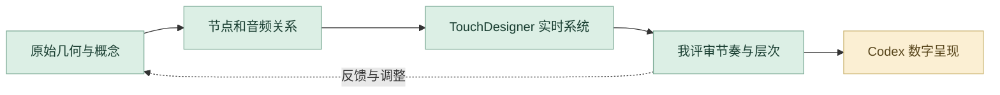

# 蜕变

TouchDesigner 几何、粒子与实时声音响应。

**[完整设计案例](https://xiongzhiyuan-portfolio.pages.dev/zh/work/metamorphosis/) · [求职作品总入口](https://github.com/Zhiyuan-Xiong/xiongzhiyuan-portfolio)**

## 项目目标

以蝴蝶形骨骸模型为视觉核心，将三维几何重构为不断生成、扰动与回流的粒子。声音经分析、放大和平滑后，驱动粒子湍动与模型缩放；液态背景、反馈与辉光共同建立有机的视听关系，让形态随声音强弱不断蜕变。

## 我的贡献

模型处理、节点编程、声音映射与视觉合成

完成阶段：几何建模、粒子生成、声音响应与实时输出

现有产出：完整节点分析、五阶段演进、实时视听影像与声音交互

## 设计制作与 AI 协作工作流

把声音、几何、粒子与视觉合成组织成持续变化的体验。我掌握实时视听的节奏与层次，AI 协作主要帮助当前案例的结构复盘、技术表达和网页交互实现。

| 阶段 | 制作、判断与 AI 协作 |
| --- | --- |
| **1. 建立声音与形态的概念** | 从蝴蝶形骨骸模型出发，明确“蜕变”如何通过生成、扰动与回流表现。把几何、粒子与液态背景看作同一个视听系统，而不是独立特效。 |
| **2. 整理节点与信号关系** | 对照原节点网络、阶段演进和声音反应序列，梳理输入、分析、放大、平滑及视觉输出。AI 辅助把复杂网络整理成可解释的步骤；原节点关系和专业判断由我核对。 |
| **3. 专业工具建立实时系统** | 在 TouchDesigner 中连接几何、粒子反馈、声音频段与合成关系。调整声音对湍动、缩放和视觉层次的影响，保留五阶段演进与实时影像。 |
| **4. Codex 转为可浏览交互** | 当前作品集通过 Codex 辅助组织声音交互、模型数据和网页渲染。我确定展示的状态、说明与入口，使招聘者可以理解原项目如何从模型演进到实时系统。 |
| **5. 我检查动态表达** | 评审响应幅度、密度、辉光、画面层次和阶段衔接，并对照录屏与网页表现。追求可读的节奏与形态变化，避免只有高强度效果却无法解释声音关系。 |
| **6. 以问题推动再次迭代** | 把“反应不明显”“层次过密”或“解释不清”分别转成参数、视觉或说明任务，再回到节点、Chat 对话或 Codex 页面迭代。最终保留过程序列、节点图和可体验案例。 |

### 审美与专业评审

| 评审维度 | 我的专业判断 |
| --- | --- |
| **视听关系** | 声音变化与粒子、形态之间有明确对应。 |
| **审美层次** | 比较密度、辉光、色彩和背景的主次。 |
| **过程表达** | 节点网络、五阶段和最终影像能够相互对照。 |

**过程证据：** [完整节点网络](https://raw.githubusercontent.com/Zhiyuan-Xiong/xiongzhiyuan-portfolio/main/public/media/metamorphosis/operator-network-large.webp) · [演进过程](https://raw.githubusercontent.com/Zhiyuan-Xiong/xiongzhiyuan-portfolio/main/public/media/metamorphosis/development-sequence-large.webp) · [声音响应序列](https://raw.githubusercontent.com/Zhiyuan-Xiong/xiongzhiyuan-portfolio/main/public/media/metamorphosis/reactive-sequence-large.webp) · [网页交互代码](https://github.com/Zhiyuan-Xiong/xiongzhiyuan-portfolio/tree/main/src/)

[阅读完整的项目工作流](metamorphosis-工作流.md) · [我的 AI 设计方法](https://github.com/Zhiyuan-Xiong/xiongzhiyuan-portfolio/blob/main/docs/AI设计工作流.md)

## 仓库内容

- [media/](https://raw.githubusercontent.com/Zhiyuan-Xiong/xiongzhiyuan-portfolio/main/public/media/)：项目公开影像、图像与交互数据。
- [images/](https://raw.githubusercontent.com/Zhiyuan-Xiong/xiongzhiyuan-portfolio/main/public/images/)：作品集封面与不同尺寸展示图。
- [site-source/](https://github.com/Zhiyuan-Xiong/xiongzhiyuan-portfolio/tree/main/src/)：对应案例文案、页面组件与相关交互实现。
- [case-data.json](https://github.com/Zhiyuan-Xiong/xiongzhiyuan-portfolio/blob/main/src/data/site.ts)：项目目标、职责、章节与产出信息。

## 查看与使用

GitHub 中可直接浏览图像、GIF、文案与实现文件。完整交互与影像观看入口为顶部的在线案例。网页组件的完整构建环境位于 [作品集总仓库](https://github.com/Zhiyuan-Xiong/xiongzhiyuan-portfolio)。

## 署名与使用

作品素材用于个人设计展示。协作项目以案例中的职责说明为准；字体、引擎和第三方资料遵循各自授权。未经许可，不将作品素材用于转载或商业用途。
