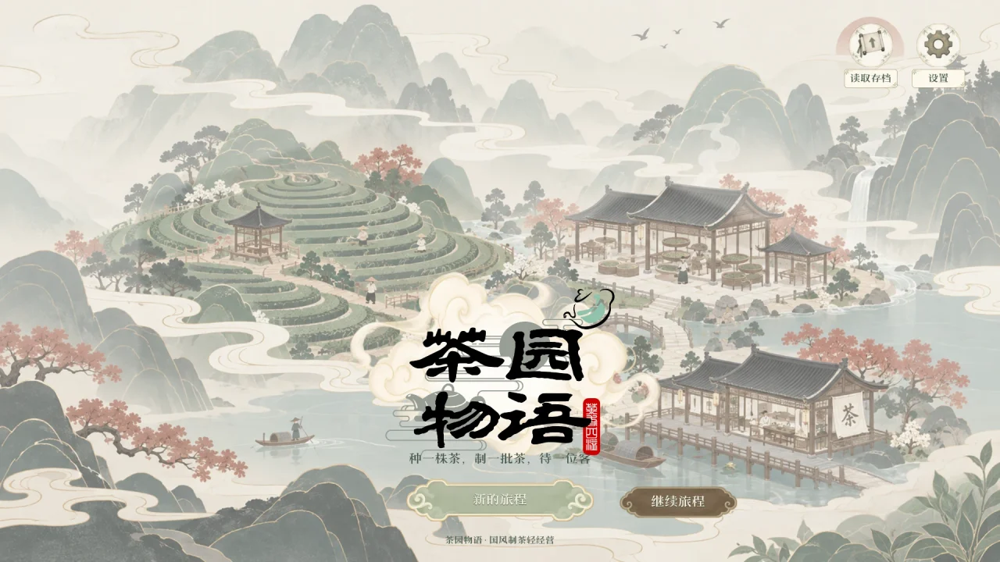
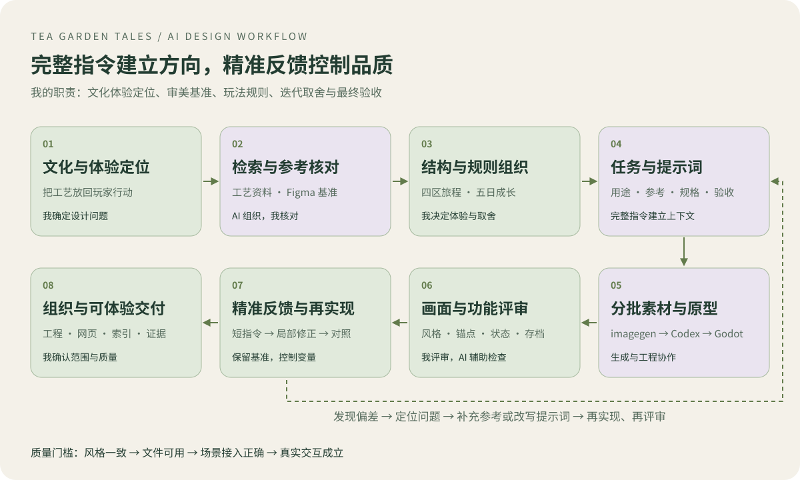
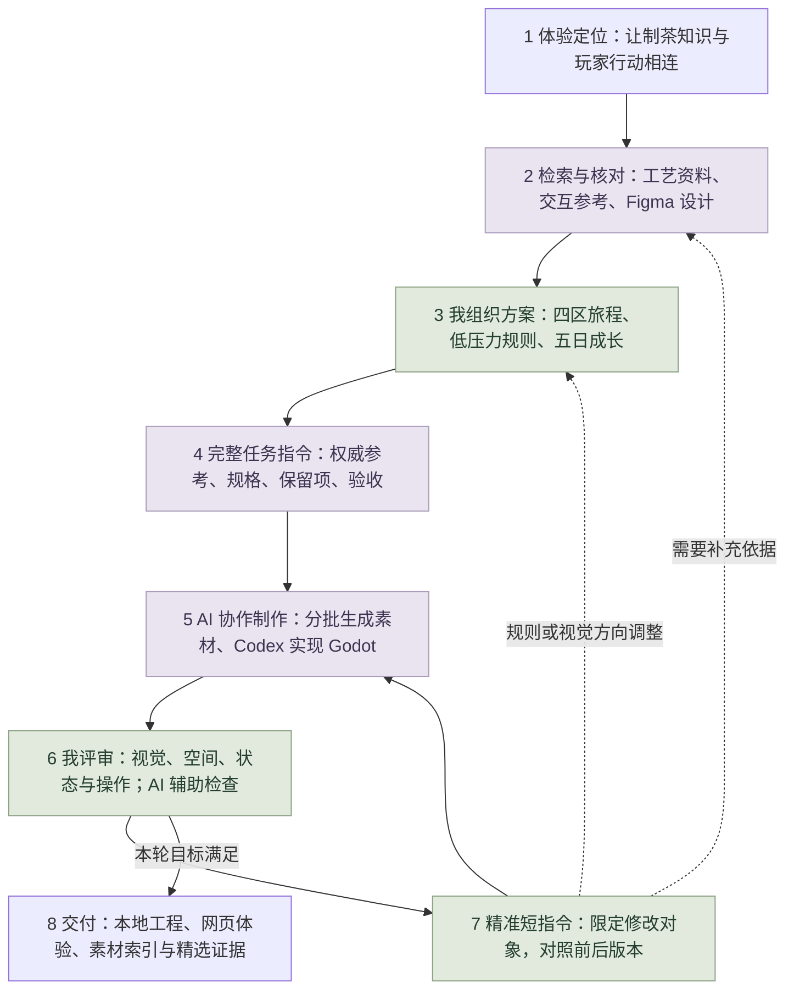
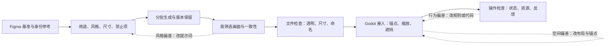

# 茶园物语｜AI 协作、设计控制与迭代

**[查看完整网页案例与核心流程体验](https://xiongzhiyuan-portfolio.pages.dev/zh/work/tea-garden/)**

围绕中国传统制茶技艺，将文化说明转译为“种植—采摘—制茶—待客”的轻经营体验。AI 贯穿方案组织、素材制作、工程实现和后续迭代；我持续负责体验架构、视觉方向、规则取舍与质量评审。

**我的方法：先用完整的文本与指令建立上下文，再以精准短指令逐次控制成果。** 每轮只明确要改变的对象、目标状态与必须保留的基准，让已有设计不断积累。图像生成、代码实现和人工设计判断各自承担适合的工作。

## 从设计问题到可运行体验

<picture>
  <source media="(prefers-color-scheme: dark)" srcset="../media/tea-ai-workflow-dark.svg">
  
</picture>

查看可编辑的完整流程图

| 阶段与输入 | 具体操作及我的控制 | 产出与验收 |
| --- | --- | --- |
| **1 体验定位**：传统制茶展示课题、现有想法 | 用 ChatGPT 辅助展开体验方向；我将重点放在行动中的理解与安静的经营节奏 | 明确设计问题与体验主张；玩家假设留待真实测试 |
| **2 资料与参考**：工艺问题、Figma 画面与技术约束 | 比较工艺资料与交互参考，组织可用信息；核对来源，区分真实工艺与游戏参数 | 工艺说明、视觉基准与实现边界；秒数和品质等级明确属于游戏规则 |
| **3 个人组织**：研究结果与已有设计 | 我确定茶村、茶园、工坊、茶铺的职责；统一资源流、五日目标与长期职业成长 | 功能架构、玩法规则与优先级；梯田开放和职业晋升分别管理 |
| **4 完整指令**：已确定的方案和权威参考 | 给出用途、角色身份、色彩、分层、尺寸、透明要求与禁止项；拆成可独立检查的批次 | 任务清单、结构化提示词和素材 ID；避免一次生成整套后才发现偏差 |
| **5 分批制作**：提示词、Figma 与资产规格 | imagegen 生成角色、植物、器具和 UI；Codex 整理素材、拆分图层并连接 Godot 场景与数据 | 保留版本的独立素材、可编辑工程和登记表；原始书法标识保持原样 |
| **6 评审测试**：素材、截图和可运行原型 | 我检查色彩、构图、身份、可读性和体验；结合透明检查、坐标检查、规则及存档测试定位问题 | 视觉评审与测试记录；透明合格后仍需实际接入场景 |
| **7 精准迭代**：具体偏差与本轮目标 | 用短指令限定局部修改；必要时重新组织提示词或补充参考，再由 Codex 修改、运行、对照 | 新素材版本、局部修正与前后截图；保持其他已确认的设计约束 |
| **8 组织交付**：通过本轮检查的资料 | 整理当前入口、历史版本、工程、索引和证据；明确网页与 Godot 的功能边界 | 可克隆资料库、可体验案例与完整交接；不以截图代替玩家验证 |

## 把 AI 产出变成可控的视觉系统

完整任务说明包含六类约束：**用途与对象 → 权威参考 → 视觉语言 → 必须保留与禁止项 → 输出规格 → 验收方式**。

例如角色素材分别指定“Figma 风格参考”和“角色身份参考”，控制青绿短发、服装与配饰；视觉采用低饱和茶绿、暖白和克制线条。要求单个可用对象、完整轮廓、外部真实透明，排除附加场景、文字、水印与伪透明棋盘格。这样后续短指令可以集中改变姿势或局部比例，而保持身份与风格稳定。

| 我把控的专业判断 | AI 与工程协作 | 实际质量标准 |
| --- | --- | --- |
| **审美与身份** | 生成候选、按参考修订 | 色彩、线条、角色服装一致；原标识与已确认构图得到保留 |
| **空间与构成** | 拆分背景、家具与植物；以数据组织位置 | 可见边界、脚底／树根锚点、地板落点与遮挡关系可信 |
| **信息与交互** | UI 图像与原生文字分离；实现状态与弹窗逻辑 | 字号、对比、内边距和待办层级清楚；弹窗正确阻挡底层操作 |
| **规则与节奏** | 统一资源、配方、职业与五日推进数据 | 成熟不腐烂、鲜叶跨日保留、订单无超时；玩家能知道下一步 |

## 三次精选迭代：短指令怎样转化为明确改动

以下是依据提示词、专项说明和前后截图整理的专业表述，保留真实决策，不作为逐字聊天引用。

| 观察到的问题 | 精准反馈与保留项 | 实现与验证 |
| --- | --- | --- |
| **单张素材可用，放入场景仍可能漂浮或比例失衡** | 保留已确认的画风与身份，改用透明图可见边界缩放，并将脚底、树根对准实际地面 | 素材检查与场景接入分开验收；批次 02 的 18 项透明检查通过时，记录仍明确“工程摆放未验证”，后续再补空间检查 |
| **早期梯田布局与 Figma 参考、成长规则不一致** | 以原始 Figma 构图为依据，统一五层、14 个种植位；五日逐层开放，职业成长独立推进 | 调整底图、坐标与规则数据；用第 1–5 日实机截图和坐标报告核对。装饰茶树与生产种植位分开管理 |
| **底板裁切、文字与状态混杂，影响操作判断** | 保留国风题签与圆形图标；采用完整底板和独立文字，让单株生长状态、今日待办与弹窗分层表达 | 分层素材与 Godot 原生文字配合；对照倒计时、可采摘、待办收起、新一天等截图，检查弹窗输入遮挡 |

对应记录：[逐场景前后版本](https://xiongzhiyuan-portfolio.pages.dev/zh/work/tea-garden/#iteration) · [分类素材展示](https://xiongzhiyuan-portfolio.pages.dev/zh/work/tea-garden/#asset-library) · [工艺来源与说明](https://xiongzhiyuan-portfolio.pages.dev/zh/work/tea-garden/#craft)。原始提示词、工程和完整验收档案存放于私有资料库

## 工具分工与成果范围

| 工具 | 在这个项目中的作用 | 我的职责 |
| --- | --- | --- |
| **ChatGPT** | 灵感展开、资料组织、方案与提示词表达 | 判断依据、目标、优先级与设计取舍 |
| **imagegen** | 依据参考制作角色、场景、植物、道具和界面候选 | 决定视觉基准，筛选、评审并提出具体修订 |
| **Codex** | 素材组织、图层处理、工程实现、局部迭代与检查 | 设定任务边界，审阅实际结果，持续控制体验与质量 |
| **Figma / Godot** | 设计基准与坐标参考；可运行游戏、原生 UI 与状态逻辑 | 视觉构成、规则、层级、交互与最终验收 |

当前成果包含可运行的本地 Godot 原型、分版本素材、生成与验收记录，以及公开网页中的核心流程适配。网页可体验种采制售、五日推进和浏览器保存；完整布置编辑器等功能以 Godot 工程为准。现有角色主要为静态姿势，走路与拾取动画尚待制作。素材自动检查和历史功能测试说明实现状态；学习效果与可用性仍需真实玩家验证。

[返回个人主页](https://github.com/Zhiyuan-Xiong) · [全部项目](../../README.md) · [通用 AI 方法与项目策略](../AI设计工作流.md)

完整源文件存放于[私有资料库 tea-garden-story-assets](https://github.com/Zhiyuan-Xiong/tea-garden-story-assets)，仅已获授权的账号可访问。面试官可直接阅读本页、查看公开素材和体验网页，无需访问私有仓库。
