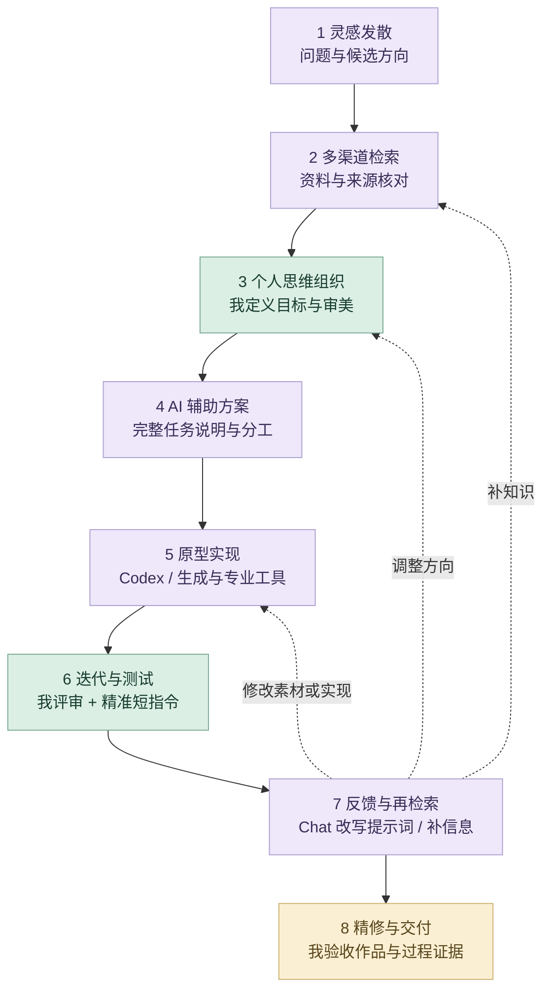

<picture>
  <source media="(prefers-color-scheme: dark)" srcset="https://raw.githubusercontent.com/Zhiyuan-Xiong/xiongzhiyuan-portfolio/main/docs/media/github-banner-dark.svg">
  <source media="(prefers-color-scheme: light)" srcset="https://raw.githubusercontent.com/Zhiyuan-Xiong/xiongzhiyuan-portfolio/main/docs/media/github-banner-light.svg">
  
</picture>

<h1 align="center">熊志愿 · Xiong Zhiyuan</h1>

<strong>AI 设计 / 视觉设计 / 创意交互</strong>

把视觉概念转化为品牌、三维、影像与可体验的作品。

<a href="https://zhiyuan-xiong.github.io/poisonous-mushrooms/">在线玩《毒蘑菇》</a> · <a href="https://zhiyuan-xiong.github.io/xiongzhiyuan-portfolio/">全部项目导航</a> · <a href="https://xiongzhiyuan-portfolio.pages.dev/zh/about/">关于我与简历</a>

## 关于我

你好，我是熊志愿，本科毕业于华中科技大学设计学院环境设计专业，目前在 UCL Bartlett 攻读性能与交互设计硕士。

我的创作连接视觉表达、三维空间与数字交互。我会使用 AI 探索图像、建立模型和辅助原型开发，再通过视觉筛选、人工雕刻、结构调整与体验验证把控最终效果。这里记录作品，也展示我在项目中的具体职责和制作过程。

| 我关注的方向 | 我如何把想法落地 | 代表实践 |
| --- | --- | --- |
| **AI 设计工作流** | 完整任务说明 → 精准短指令迭代 → 人工评审与交付 | 骨骸共生系统、毒蘑菇、Earthquake |
| **视觉与品牌设计** | 从概念、视觉语言与 Logo，延展到首饰、三维场景和影像 | SPRING、机械文明计划 |
| **创意交互** | 用游戏、实时视觉、参数化设计与声音映射，让作品可以体验 | 毒蘑菇、无垠的宇宙、蜕变 |

## 代表作品

<table>
<tr><td width="50%"> <strong>《毒蘑菇》</strong> AI 素材 → Godot 游戏 → 在线体验</td><td width="50%"> <strong>骨骸共生系统</strong> AI 图像与建模 → 人工雕刻 → 品牌与首饰</td></tr>
<tr><td width="50%"> <strong>无垠的宇宙</strong> 参数化模型 → Processing → ComfyUI 影像</td><td width="50%"> <strong>地震：数据转译</strong> 多模态分析 → 人工映射 → 空间与动态视觉</td></tr>
</table>

## 我的 AI 设计与迭代方法

我先用完整的任务说明建立上下文：交代项目目标、参考资料、审美方向、实现约束、输出格式与验收标准，让 ChatGPT 和 Codex 理解要完成什么。得到初步方案或原型后，我再以精准的短指令逐轮控制修改，明确本轮改什么、保留什么，并对照实际结果继续判断。**完整指令建立方向，短指令控制细节，专业判断决定交付。**

<picture>
  <source media="(prefers-color-scheme: dark)" srcset="https://raw.githubusercontent.com/Zhiyuan-Xiong/xiongzhiyuan-portfolio/main/docs/media/ai-workflow-8steps-dark.svg">
  
</picture>

| 控制方式 | 我怎样使用 | 体现的能力 |
| --- | --- | --- |
| **完整任务说明** | 目标、参考、结构、风格、规格与验收一次交代清楚 | 把设计问题组织成可执行任务 |
| **精准短指令** | 在既有上下文中限定本轮修改对象、幅度和保留项 | 用审美判断控制局部结果 |
| **逐轮对照验收** | 看画面、运行原型，核对修改结果与已有约束 | 保持视觉一致性和专业可用性 |

展开八阶段流程与反馈路径

| 我的能力 | 怎样让结果可控 | 项目例子 |
| --- | --- | --- |
| **把审美转成约束** | 明确参考、角色比例、色彩、形态、构图与可变区域 | 毒蘑菇：一致的角色、动画、UI 与游戏场景 |
| **连接 AI 与专业制作** | AI 探索方向或初始形体，我用专业工具完成结构与细节 | 骨骸共生：Midjourney → Tripo 3D → ZBrush／Nomad |
| **按任务设计策略** | 区分资产生成、多模态分析、产品 UX 和生成影像 | Earthquake、饭搭子、无垠的宇宙 |
| **用实际反馈迭代** | 视觉评审、原型运行与测试，推动提示词、代码和方案更新 | 毒蘑菇在线试玩、作品集交互与公开制作记录 |

**[查看完整八阶段流程、项目策略与质量控制](https://github.com/Zhiyuan-Xiong/xiongzhiyuan-portfolio/blob/main/docs/AI设计工作流.md)**

## 项目精选与我的贡献

| 项目 | 我的具体贡献 | 项目材料 | 在线案例 |
| --- | --- | --- | --- |
| **《毒蘑菇》** | 视觉概念与分镜；AI 素材、Godot 搭建和体验验证；参与 MV 视觉统一 | [查看](https://github.com/Zhiyuan-Xiong/poisonous-mushrooms) | [打开](https://xiongzhiyuan-portfolio.pages.dev/zh/work/poisonous-mushrooms/) |
| **骨骸共生系统** | SPRING 品牌视觉与 Logo；Midjourney、Tripo 3D 与 ZBrush／Nomad 首饰制作 | [查看](https://github.com/Zhiyuan-Xiong/spring-skeleton-collection) | [打开](https://xiongzhiyuan-portfolio.pages.dev/zh/work/bone-series/) |
| **无垠的宇宙** | 参数化建模、交互编程与生成影像设计 | [查看](https://github.com/Zhiyuan-Xiong/infinite-cosmos) | [打开](https://xiongzhiyuan-portfolio.pages.dev/zh/work/infinite-cosmos/) |
| **地震：数据转译** | Python 数据处理、参数映射与空间可视化 | [查看](https://github.com/Zhiyuan-Xiong/BARC0074-Digital-Skills-Report-Codebook-25097154) | [打开](https://xiongzhiyuan-portfolio.pages.dev/zh/work/earthquake/) |
| **蜕变** | 模型处理、节点编程、声音映射与视觉合成 | [查看](https://github.com/Zhiyuan-Xiong/metamorphosis) | [打开](https://xiongzhiyuan-portfolio.pages.dev/zh/work/metamorphosis/) |
| **饭搭子** | 产品概念、饮食记录与食宠 UX、Godot 原型和 AI 照片工作流（进行中） | [查看](https://github.com/Zhiyuan-Xiong/fandazi) | [打开](https://xiongzhiyuan-portfolio.pages.dev/zh/works/?project=fandazi) |
| **病名异化实验场** | 交互体验与视觉设计（协作项目） | [查看](https://github.com/Zhiyuan-Xiong/the-big-bang-stigma) | [打开](https://xiongzhiyuan-portfolio.pages.dev/zh/work/stigma/) |
| **相亲营销嘉年华** | 交互叙事、场景与视觉设计 | [查看](https://github.com/Zhiyuan-Xiong/dating-carnival) | [打开](https://xiongzhiyuan-portfolio.pages.dev/zh/work/dating-carnival/) |
| **机械文明计划** | 概念场景、三维建模与渲染 | [查看](https://github.com/Zhiyuan-Xiong/nexus-mechanical-civilization) | [打开](https://xiongzhiyuan-portfolio.pages.dev/zh/work/nexus/) |
| **声学弹性** | 装置设计与制作（协作项目） | [查看](https://github.com/Zhiyuan-Xiong/sonic-elasticity) | [打开](https://xiongzhiyuan-portfolio.pages.dev/zh/work/sonic-elasticity/) |

## 教育背景

- **伦敦大学学院 UCL · Bartlett 建筑学院**：性能与交互设计硕士在读。
- **华中科技大学 · 设计学院**：环境设计本科。

## 创作工具

| 制作环节 | 使用的工具 |
| --- | --- |
| AI 探索与实现 | ChatGPT、Midjourney、Tripo 3D、ComfyUI、imagegen、Codex |
| AI 视频生成 | 即梦／Seedance |
| 视觉、三维与人工细化 | Photoshop、Illustrator、Figma、Blender、C4D、Rhino、ZBrush、Nomad |
| 交互与数据原型 | Godot、TouchDesigner、Processing、Grasshopper、Python |

## 个人贡献与制作记录

每个项目都标注了我的职责；协作项目保留团队分工说明。你可以通过项目素材、源文件与提交记录了解作品的实现过程。

[个人贡献汇总](https://github.com/Zhiyuan-Xiong/xiongzhiyuan-portfolio/blob/main/docs/个人贡献.md) · [作品集网站提交记录](https://github.com/Zhiyuan-Xiong/xiongzhiyuan-portfolio/commits/main) · [毒蘑菇游戏提交记录](https://github.com/Zhiyuan-Xiong/poisonous-mushrooms/commits/main) · [Earthquake 研究代码](https://github.com/Zhiyuan-Xiong/BARC0074-Digital-Skills-Report-Codebook-25097154)

## 联系我

如果你正在寻找 AI 设计、视觉设计或创意设计方向的伙伴，欢迎通过邮箱联系我。

**[个人作品集](https://xiongzhiyuan-portfolio.pages.dev/) · [下载中文简历](https://xiongzhiyuan-portfolio.pages.dev/resume/zhiyuan-experience-2026.pdf) · [xiongzhiyuan1027@163.com](mailto:xiongzhiyuan1027@163.com)**
